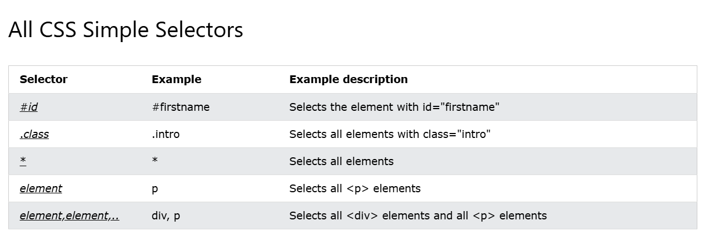
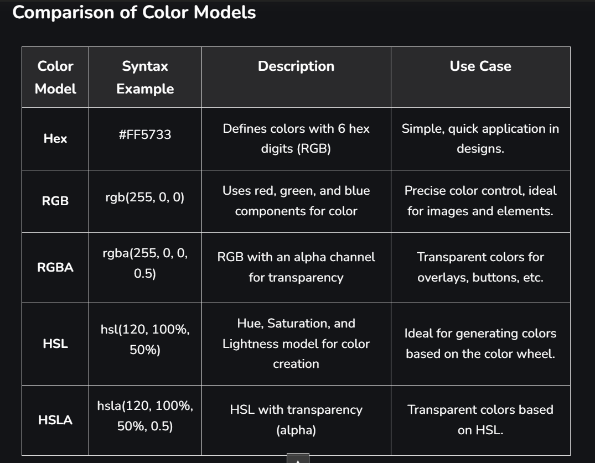
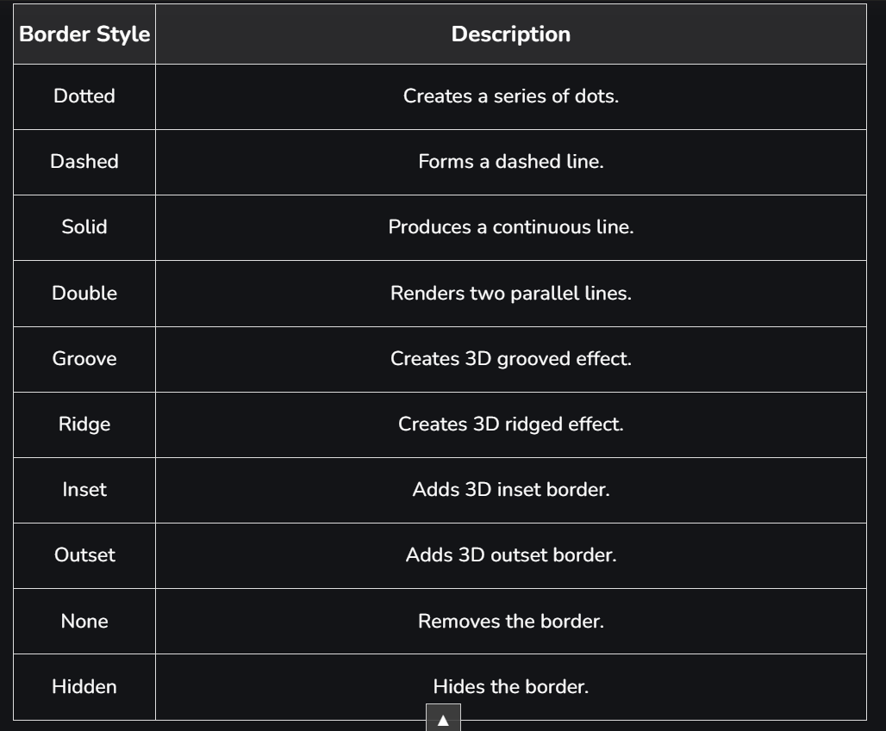
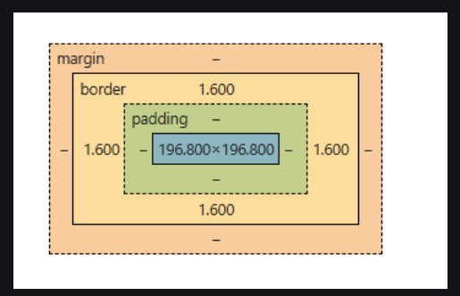
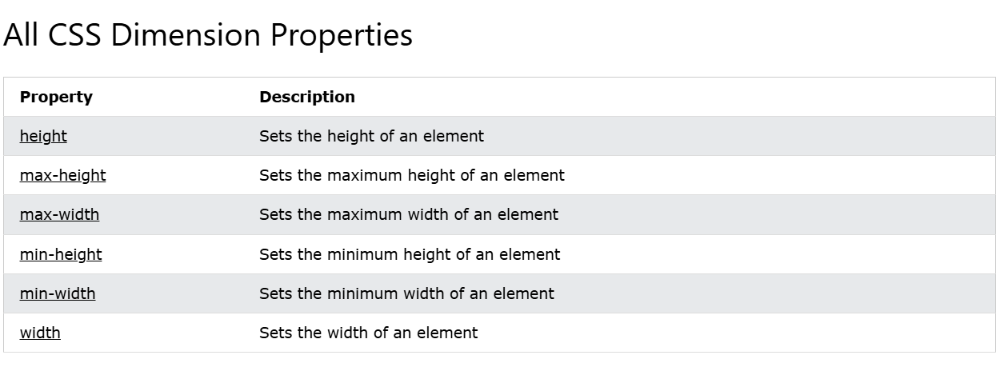
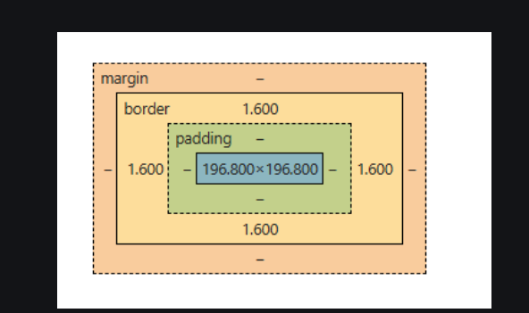

# CSS Introduction

CSS is the language we use to style a web page.

## What is CSS?

- **CSS** stands for *Cascading Style Sheets*.
- CSS describes how HTML elements are to be displayed on screen, paper, or in other media.
- CSS saves a lot of work. It can control the layout of multiple web pages all at once.
- External stylesheets are stored in `.css` files.

## Why Use CSS?

- **Separation of Content and Design:** Helps in keeping HTML clean and focusing only on structure.
- **Consistency:** Ensures a uniform look across multiple pages.
- **Efficient Maintenance:** Changes can be made easily by updating a single CSS file.
- **Faster Page Loading:** Reduces HTML file size and improves performance.

## Types of CSS

1. **Inline CSS**  
   - Applied directly within an HTML tag using the `style` attribute.  
   - Example:  

   ```html
   <p style="color: blue; font-size: 20px;">This is a blue paragraph.</p>
   ```

2. **Internal CSS**  
   - Defined inside a `<style>` tag within the HTML document.  
   - Example:  

   ```html
   <style>
       p {
           color: red;
           font-size: 18px;
       }
   </style>
   ```

3. **External CSS**  
   - Stored in a separate CSS file and linked to HTML using the `<link>` tag.  
   - Example:  

   ```html
   <link rel="stylesheet" href="styles.css">
   ```

## CSS Syntax

A CSS rule consists of:

- **Selector:** Specifies the HTML element to be styled.
- **Declaration Block:** Contains property-value pairs.

Example:

```css
p {
    color: green;
    font-size: 16px;
}
```

## Example of Using External CSS

**HTML (index.html):**

```html
<!DOCTYPE html>
<html lang="en">
<head>
    <meta charset="UTF-8">
    <meta name="viewport" content="width=device-width, initial-scale=1.0">
    <title>CSS Example</title>
    <link rel="stylesheet" href="styles.css">
</head>
<body>
    <h1>Welcome to CSS</h1>
    <p>This is an example of external CSS.</p>
</body>
</html>
```

**CSS (styles.css):**

```css
body {
    background-color: lightgray;
    font-family: Arial, sans-serif;
}

h1 {
    color: navy;
    text-align: center;
}

p {
    font-size: 18px;
    color: darkgreen;
}
```

# CSS Syntax Breakdown

## Selectors

Selectors are used to “select” the HTML element you want to style. They help in targeting elements by type, class, ID, or using universal selectors.

### Types of Selectors

1. **Type Selector:**  
   - Targets all elements of a specific type (e.g., `h1`, `p`, `div`).  
   - Example:  

   ```css
   h1 {
       font-family: Arial, sans-serif;
   }
   ```

2. **Class Selector:**  
   - Targets elements with a specific class.  
   - Example:  

   ```css
   .my-class {
       color: blue;
   }
   ```

3. **ID Selector:**  
   - Targets an element with a specific ID.  
   - Example:  

   ```css
   #my-id {
       background-color: yellow;
   }
   ```

4. **Universal Selector:**  
   - Targets all elements on a page.  
   - Example:  

   ```css
   * {
       margin: 0;
       padding: 0;
   }
   ```



## Properties

Properties define the aspects of the selected elements you want to style. Some commonly used CSS properties include:

- **color:** Defines the text color.  

  ```css
  p {
      color: red;
  }
  ```
  
- **background-color:** Sets the background color of an element.  

  ```css
  body {
      background-color: lightgray;
  }
  ```
  
- **font-size:** Specifies the size of the font.  

  ```css
  h1 {
      font-size: 24px;
  }
  ```
  
- **margin:** Defines the space around an element.  

  ```css
  div {
      margin: 20px;
  }
  ```
  
- **padding:** Defines the space between the content and border of an element.  

  ```css
  .container {
      padding: 15px;
  }
  ```

## Values

Values specify the details of the property applied. They can include:

- **Color names or codes:**  

  ```css
  color: blue; 
  color: #ff5733;
  ```
  
- **Size units (e.g., px, %, em):**  

  ```css
  font-size: 16px;
  width: 50%;
  ```

## Example of CSS Selectors in Action

```html
<!DOCTYPE html>
<html lang="en">
<head>
    <meta charset="UTF-8">
    <meta name="viewport" content="width=device-width, initial-scale=1.0">
    <title>CSS Selectors</title>
    <style>
        * {
            margin: 0;
            padding: 0;
        }
        h1 {
            font-size: 28px;
            color: darkblue;
        }
        .box {
            border: 2px solid black;
            padding: 20px;
        }
        #header {
            background-color: lightgray;
            text-align: center;
        }
    </style>
</head>
<body>
    <div id="header">
        <h1>Welcome to CSS</h1>
    </div>
    <div class="box">
        This is a styled box.
    </div>
</body>
</html>
```

## Additional Data

- **Grouping Selectors:**  
  - You can group multiple selectors to apply the same style to different elements.  

  ```css
  h1, h2, p {
      font-family: Arial, sans-serif;
  }
  ```

- **Pseudo-classes:**  
  - Special selectors to style elements based on their state.  

  ```css
  a:hover {
      color: green;
  }
  ```

- **Combining Selectors:**  
  - You can combine selectors for more specific styling.  

  ```css
  div.box p {
      font-style: italic;
  }
  ```

# CSS Colors

**Last Updated:** 19 Dec, 2024

CSS colors are used to set the color of different parts of a webpage, like text, background, and borders. This helps make the page look more attractive and easier to read. You can define colors using names, hex codes, RGB values, and more.

You can try different formats of colors here:

## Color Formats in CSS

| Color Format | Description |
|--------------|-------------|
| **Color Names** | Use predefined color names (e.g., red, blue, green) for simplicity. |
| **Hexadecimal (Hex) Codes** | Define colors using six-digit hex codes (e.g., `#FF5733`). |
| **RGB (Red, Green, Blue)** | Define colors using RGB values (e.g., `rgb(255, 0, 0)`). |
| **RGBA (Red, Green, Blue, Alpha)** | Extend RGB by adding an alpha (transparency) value (e.g., `rgba(255, 0, 0, 0.5)`). |
| **HSL (Hue, Saturation, Lightness)** | Define colors using HSL values (e.g., `hsl(120, 100%, 50%)`). |
| **HSLA (Hue, Saturation, Lightness, Alpha)** | Extend HSL by adding an alpha value for transparency (e.g., `hsla(120, 100%, 50%, 0.5)`). |

## Example Code

```html
<html>
<head>
    <style>
        .hex-example {
            background-color: #FF5733; /* Hexadecimal color */
        }
        .rgb-example {
            color: rgb(255, 0, 0); /* RGB color */
        }
        .rgba-example {
            color: rgba(0, 255, 0, 0.5); /* RGBA color with transparency */
        }
        .hsl-example {
            color: hsl(120, 100%, 50%); /* HSL color */
        }
        .hsla-example {
            color: hsla(120, 100%, 50%, 0.3); /* HSLA color with transparency */
        }
    </style>
</head>
<body>
    <div class="hex-example">This div has a Hexadecimal background color.</div>
    <div class="rgb-example">This text is in RGB red.</div>
    <div class="rgba-example">This text is in RGBA green with 50% transparency.</div>
    <div class="hsl-example">This text is in HSL green.</div>
    <div class="hsla-example">This text is in HSLA green with 30% opacity.</div>
</body>
</html>
```

### Explanation

**Background Color (background-color):**

```css
background-color: #FF5733; /* Applies a bright red-orange color using a hex code. */
padding: 20px; /* Adds space inside the div to make it more visible. */
```

**Text Color (color):**

```css
color: rgb(255, 0, 0); /* Sets the text color to red using RGB notation. */
font-size: 20px; /* Increases text size. */
```

**Border Color (border):(Will Discuss soon):**

```css
border: 5px solid rgba(0, 255, 0, 0.5); /* Green border with 50% transparency. */
padding: 10px;
margin: 10px;
```

**Hover Effects:(Will Discuss soon):**

```css
.hover-example {
    background-color: hsl(120, 100%, 50%); /* Bright green background. */
}
.hover-example:hover {
    background-color: hsla(120, 100%, 50%, 0.7); /* Transparent lighter green on hover. */
}
```

## Use Cases of CSS Colors with Code Examples

### 1. Background Colors

```html
<html>
<head>
    <style>
        .bg-example {
            background-color: #FF5733; /* Red-Orange background */
            padding: 20px;
            color: white;
        }
    </style>
</head>
<body>
    <div class="bg-example">This div has a warm background color!</div>
</body>
</html>
```

### 2. Text Colors

```html
<html>
<head>
    <style>
        .text-example {
            color: rgb(255, 0, 0); /* Red text */
            font-size: 20px;
        }
    </style>
</head>
<body>
    <p class="text-example">This text is in red.</p>
</body>
</html>
```

### 3. Border Colors (Will Discuss soon)

```html
<html>
<head>
    <style>
        .border-example {
            border: 5px solid rgba(0, 255, 0, 0.5); /* Semi-transparent green border */
            padding: 10px;
            margin: 10px;
        }
    </style>
</head>
<body>
    <div class="border-example">This div has a semi-transparent green border.</div>
</body>
</html>
```



# CSS Border

The **CSS border** properties allow you to specify the **style, width, and color** of an element's border.

The CSS border properties are used to define the **style, color, and size** of an element's border. The key border properties include:

- `border-style`
- `border-color`
- `border-width`
- `border-radius`

---

## CSS `border-style`

The `border-style` property specifies the type of border to be displayed.

### Allowed Values

- **dotted** - Defines a dotted border  
- **dashed** - Defines a dashed border  
- **solid** - Defines a solid border  
- **double** - Defines a double border  
- **groove** - Defines a 3D grooved border (effect depends on border-color)  
- **ridge** - Defines a 3D ridged border (effect depends on border-color)  
- **inset** - Defines a 3D inset border (effect depends on border-color)  
- **outset** - Defines a 3D outset border (effect depends on border-color)  
- **none** - No border  
- **hidden** - Hidden border  

---



## CSS `border-width`

The `border-width` property is used to set the thickness of the border. It can be defined in **pixels (px)** or using the predefined values:

- **thin**  
- **medium**  
- **thick**  

Example:

```css
border-width: 5px;  /* Sets a 5px thick border */
border-width: medium; /* Uses predefined width */
```

---

## CSS `border-color`

The `border-color` property allows you to set the color of the border using three methods:

1. **Name:** Specifies the color name (e.g., `"red"`).  
2. **RGB:** Specifies the RGB value (e.g., `"rgb(255,0,0)"`).  
3. **Hex:** Specifies the hex value (e.g., `"#ff0000"`).  

Example:

```css
border-color: blue; /* Using color name */
border-color: rgb(0, 255, 0); /* Using RGB value */
border-color: #0000ff; /* Using HEX value */
```

---

## Example Code

```html
<!DOCTYPE html>
<html>
  <head>
    <title>CSS Border Example</title>
    <style>
        h1 {
            /* Example using individual properties */
            /* border-width: 3px;
            border-style: solid dotted dashed inset;
            border-color: red; */

            /* Shorthand notation */
            /* border: 3px solid red; */

            border-bottom: 3px solid red;
            border-top: 3px dashed green;
        }
    </style>
  </head>

  <body>
    <h1>Uzair : CSS Border</h1>

    <p>
      Lorem ipsum dolor sit amet, consectetur adipiscing elit. Donec quis lectus ac ipsum lobortis malesuada vitae vitae lorem. Vestibulum euismod, lacus a dictum ultrices, lorem libero porttitor dui, in feugiat sem lacus eget elit.
    </p>

    <p>
      Lorem ipsum dolor sit amet, consectetur adipiscing elit. Donec quis lectus ac ipsum lobortis malesuada vitae vitae lorem. Vestibulum euismod, lacus a dictum ultrices, lorem libero porttitor dui, in feugiat sem lacus eget elit.
    </p>
  </body>
</html>
```

---

## Explanation

- The **`border-bottom`** property applies a **solid red** border of `3px` to the bottom of the heading.
- The **`border-top`** property applies a **dashed green** border of `3px` to the top of the heading.
- The paragraph text provides sample content for layout demonstration.


# CSS Outline

The CSS `outline` property allows you to draw a line around an element, outside its border, to make it stand out. Unlike borders, outlines do not occupy space or affect the element's dimensions; they are drawn over the element and may overlap other content. ([W3Schools.com](https://www.w3schools.com/css/css_outline.asp?utm_source=chatgpt.com))

**Key Differences Between Borders and Outlines:**

- **Position:** Outlines are drawn outside the element's border, whereas borders are part of the element's box model.
- **Space:** Outlines do not take up space or affect the layout; borders do.
- **Customization:** Outlines cannot be applied to specific sides of an element; they encompass all sides.

**CSS Outline Properties:**

1. **`outline-style`:** Specifies the style of the outline. Possible values include:
   - `dotted`
   - `dashed`
   - `solid`
   - `double`
   - `groove`
   - `ridge`
   - `inset`
   - `outset`
   - `none`
   - `hidden`

2. **`outline-width`:** Sets the width of the outline. It can be specified in length units (e.g., `px`, `em`) or by using predefined values:
   - `thin`
   - `medium`
   - `thick`

3. **`outline-color`:** Defines the color of the outline. It accepts color names, HEX values, RGB, or HSL values.

4. **`outline-offset`:** Specifies the space between the outline and the border edge. This property creates a gap between the border and the outline, enhancing visual separation.

5. **`outline`:** A shorthand property to set `outline-width`, `outline-style`, and `outline-color` in a single declaration.

**Example Usage:**

```html
<!DOCTYPE html>
<html>
<head>
  <title>CSS Outline Example</title>
  <style>
    p {
      border: 3px solid red;
      outline: 2px dashed green;
      outline-offset: 4px;
    }
  </style>
</head>
<body>
  <h1>CSS Outline Example</h1>
  <p>
    This paragraph has a red border and a green dashed outline with an offset.
  </p>
</body>
</html>
```

In this example, the paragraph has a solid red border and a dashed green outline. The `outline-offset` property creates a 4-pixel space between the border and the outline, making the outline more distinct.

**Accessibility Consideration:**

Be cautious when removing outlines, especially on focusable elements like links or buttons. Outlines are crucial for keyboard navigation and accessibility. If you remove the default outline (e.g., using `outline: none;`), ensure you provide an alternative visual indicator for focus states to maintain usability for all users. ([MDN Web Docs](https://developer.mozilla.org/en-US/docs/Web/CSS/outline?utm_source=chatgpt.com))

By understanding and utilizing the CSS outline properties, you can effectively highlight elements on your webpage without affecting their layout or dimensions.

# CSS Units

**Last Updated: 14 Jan, 2025**

CSS units define the size of elements, with absolute units (like `px`, `cm`) having fixed values and relative units (like `em`, `rem`, `%`, `vh`) depending on factors like the viewport or parent elements.

There are two types of units: **Absolute** and **Relative**.

---

## Absolute Units

Absolute units in CSS, such as `px`, `cm`, and `mm`, have fixed values and do not change based on the viewport or parent elements. They are used when precise, unchanging measurements are needed for elements.

### 1. cm (Centimeter)

A centimeter (`cm`) is a length unit in the SI system, derived from the meter (`m`), with:

- **1 m = 100 cm**
  
```html
<style>
    p {
        font-size: 2cm;
        color: green;
    }
</style>
```

---

### 2. mm (Millimeter)

The millimeter (`mm`), introduced during the French Revolution’s metric system, became part of the SI system.

- **1 cm = 10 mm**
- **1 mm = 1/10 cm**

```html
<style>
    p {
        font-size: 2mm;
        color: green;
    }
</style>
```

---

### 3. in (Inch)

The inch originated from ancient human measurements and was standardized in 1959.

- **1 inch = 2.54 cm = 25.4 mm**

```html
<style>
    p {
        font-size: 1in;
        color: green;
    }
</style>
```

---

### 4. px (Pixel)

A pixel (`px`) is the smallest unit on a digital screen.

- **1 px = 0.26 mm**

```html
<style>
    p {
        font-size: 23px;
        color: green;
    }
</style>
```

---

### 5. pt (Point)

A point (`pt`) is a typography unit, commonly used in print.

- **1 pt = 1/72 inch**
- **1 pt = 1.33 px**

```html
<style>
    p {
        font-size: 100pt;
        color: green;
    }
</style>
```

---

### 6. pc (Pica)

A pica (`pc`) is equal to 12 points or 1/6 of an inch.

- **1 pc = 12 pt = 15.96 px**

```html
<style>
    p {
        font-size: 12pc;
        color: green;
    }
</style>
```

---

## Relative Units

Relative units depend on the parent element or viewport size, making them useful for responsive designs.

### 1. em

The `em` unit refers to the font-size of its parent element.

```html
<style>
    .ok {
        font-size: 20px;
    }
    .para {
        font-size: 2em;
    }
</style>
```

> If the parent font-size is 20px, then `2em` means 40px.

---

### 2. rem

The `rem` unit is based on the root `<html>` font-size.

```html
<style>
    html {
        font-size: 25px;
    }
    .para {
        font-size: 2rem;
        color: red;
    }
</style>
```

> If the root font-size is 25px, then `2rem` means 50px.

---

### 3. vw (Viewport Width)

`vw` depends on the viewport width.

```html
<style>
    .para {
        height: 10vw;
        width: 50vw;
        border: 2px solid black;
        background-color: chocolate;
    }
</style>
```

---

### 4. vh (Viewport Height)

The `vh` unit represents 1% of the viewport height.

```html
<style>
    .full-height {
        height: 100vh;
        background-color: lightblue;
        display: flex;
        justify-content: center;
        align-items: center;
    }
</style>
```

---

### 5. % (Percentage)

The `%` unit is relative to the parent element’s size.

```html
<style>
    .container {
        width: 300px;
        height: 200px;
        background-color: lightgreen;
    }
    .child {
        width: 50%;
        height: 50%;
        background-color: lightcoral;
    }
</style>
```

---

### 6. vmin

The `vmin` unit is based on the smaller of the viewport's width or height.

```html
<style>
    div {
        height: 20vmin;
        width: 20vmin;
        background-color: blueviolet;
    }
</style>
```

---

### 7. vmax

The `vmax` unit is based on the larger viewport dimension.

```html
<style>
    div {
        height: 10vmax;
        width: 10vmax;
        background-color: cadetblue;
    }
</style>
```

---

### 8. ch

The `ch` unit represents the width of the “0” character of the current font.

```html
<style>
    .small {
        font-family: monospace;
        font-size: 25px;
        height: 10ch;
        width: 10ch;
        background-color: cornflowerblue;
    }
</style>
```

---

### 9. ex

The `ex` unit is based on the height of the letter “x” in the current font.

```html
<style>
    .small {
        font-family: monospace;
        font-size: 25px;
        height: 10ex;
        width: 10ex;
        background-color: cornflowerblue;
    }
</style>
```

---

### 10. lh (Line Height)

The `lh` unit depends on the line-height of the element.

```html
<style>
    .small {
        font-family: sans-serif;
        font-size: 25px;
        line-height: 10;
        height: 2lh;
        width: 2lh;
        background-color: aquamarine;
    }
</style>
```

---

## Difference Between Absolute and Relative Units in CSS

| **Feature**        | **Absolute Units**          | **Relative Units**               |
|-------------------|---------------------------|----------------------------------|
| Definition         | Fixed values               | Based on parent/viewport         |
| Responsiveness     | Not responsive             | Responsive                       |
| Common Examples   | `cm`, `mm`, `px`            | `em`, `rem`, `%`, `vh`, `vw`     |
| Use Case           | Print, fixed layouts       | Web, responsive designs          |

---

**Conclusion:**  
CSS units play a vital role in web design, allowing for both fixed and flexible layouts depending on the requirements.





# CSS Padding

The CSS padding properties are used to generate space around an element's content, inside of any defined borders.

With CSS, you have full control over the padding. There are properties for setting the padding for each side of an element (top, right, bottom, and left).

## CSS Padding Properties

| Property        | Description                                                                 |
|-----------------|-----------------------------------------------------------------------------|
| `padding`       | It is used to set all the padding properties in one declaration.            |
| `padding-left`  | It is used to set left padding of an element.                               |
| `padding-right` | It is used to set right padding of an element.                              |
| `padding-top`   | It is used to set top padding of an element.                                |
| `padding-bottom`| It is used to set bottom padding of an element.                             |

### Padding with Multiple Values

- If the padding property has **three values**:
  
  ```css
  padding: 25px 50px 75px;
  ```
  - Top padding is `25px`
  - Right and left paddings are `50px`
  - Bottom padding is `75px`

- If the padding property has **two values**:

  ```css
  padding: 25px 50px;
  ```
  - Top and bottom paddings are `25px`
  - Right and left paddings are `50px`

- If the padding property has **one value**:

  ```css
  padding: 25px;
  ```
  - All four paddings are `25px`

## Example

```html
<html>
  <head>
    <title>CSS Padding</title>
    <style>
        .test {
            border: 2px solid black;
            padding: 20px 50px;
        }
    </style>
  </head>

  <body>
    <h1>Uzair : CSS Padding</h1>

    <div class="test">
        Suspendisse molestie nibh massa, eget convallis dolor convallis ut. Aenean efficitur nec augue at vehicula. Nunc tempor ac ante a aliquam. Duis lacinia dolor in libero ornare, at aliquam metus posuere. Phasellus porttitor, diam et semper tempus, nisl nunc ullamcorper sem, in viverra ex ligula a lacus. Donec ac sapien urna. Sed id est orci. Interdum et malesuada fames ac ante ipsum primis in faucibus. Mauris ex metus, tincidunt non massa volutpat, pharetra vulputate libero. Donec vehicula dolor sit amet lacinia viverra. Pellentesque sed luctus sem. Duis turpis purus, vestibulum egestas posuere cursus, imperdiet in lacus. Proin vehicula semper aliquam. Maecenas sodales sagittis lobortis. Etiam felis massa, tempus fermentum felis ut, pretium mattis dui.
    </div>
  </body>
</html>
```

---


# CSS Margin

The CSS Margin property is used to define the space around elements. It is completely transparent and doesn't have any background color. It clears an area around the element. Top, bottom, left, and right margins can be changed independently using separate properties. You can also change all properties at once by using the shorthand margin property.

CSS has properties for specifying the margin for each side of an element:

- `margin-top`
- `margin-right`
- `margin-bottom`
- `margin-left`

## Margin - Shorthand Property

To shorten the code, it is possible to specify all the margin properties in one property.

The margin property is a shorthand property for the following individual margin properties:

- If the margin property has **four values**:

  ```css
  margin: 25px 50px 75px 100px;
  ```
  - Top margin is `25px`
  - Right margin is `50px`
  - Bottom margin is `75px`
  - Left margin is `100px`

- If the margin property has **three values**:

  ```css
  margin: 25px 50px 75px;
  ```
  - Top margin is `25px`
  - Right and left margins are `50px`
  - Bottom margin is `75px`

- If the margin property has **two values**:

  ```css
  margin: 25px 50px;
  ```
  - Top and bottom margins are `25px`
  - Right and left margins are `50px`

- If the margin property has **one value**:

  ```css
  margin: 25px;
  ```
  - All four margins are `25px`

## Example

```html
<html>
  <head>
    <title>CSS Margin</title>
    <style>
      h1 {
        margin: 0 0 50px;
      }
      #first {
        border: 2px solid black;
        margin-bottom: 30px;
      }

      #second {
        border: 2px solid red;
        margin: 10px 200px 10px 300px;
      }

      #third {
        width: 500px;
        border: 2px solid green;
        margin: 10px auto;
      }
    </style>
  </head>

  <body>
    <h1>Uzair : CSS Margin</h1>

    <div id="first">
        Lorem ipsum dolor sit amet, consectetur adipiscing elit. Donec quis lectus ac ipsum lobortis malesuada vitae vitae lorem. Vestibulum euismod, lacus a dictum ultrices, lorem libero porttitor dui, in feugiat sem lacus eget elit. Nunc ultricies varius ligula in egestas. Nunc blandit malesuada nisi ut dapibus. Cras in malesuada lectus, eu rhoncus erat. Vivamus fermentum nisi malesuada mauris accumsan, cursus convallis dolor dictum. Sed hendrerit dictum dignissim. Maecenas eget luctus neque, at sollicitudin metus. Etiam urna turpis, aliquam quis semper at, rutrum et risus. Duis laoreet, nulla non maximus laoreet, risus erat mollis augue, sit amet consequat magna orci et dolor. Praesent fermentum nisl quis urna gravida, ac lacinia velit pretium. Aliquam at arcu et erat porta convallis ut non turpis.
    </div>

    <div id="second">
        Lorem ipsum dolor sit amet, consectetur adipiscing elit. Donec quis lectus ac ipsum lobortis malesuada vitae vitae lorem. Vestibulum euismod, lacus a dictum ultrices, lorem libero porttitor dui, in feugiat sem lacus eget elit. Nunc ultricies varius ligula in egestas. Nunc blandit malesuada nisi ut dapibus. Cras in malesuada lectus, eu rhoncus erat. Vivamus fermentum nisi malesuada mauris accumsan, cursus convallis dolor dictum. Sed hendrerit dictum dignissim. Maecenas eget luctus neque, at sollicitudin metus. Etiam urna turpis, aliquam quis semper at, rutrum et risus. Duis laoreet, nulla non maximus laoreet, risus erat mollis augue, sit amet consequat magna orci et dolor. Praesent fermentum nisl quis urna gravida, ac lacinia velit pretium. Aliquam at arcu et erat porta convallis ut non turpis.
    </div>
    Lorem ipsum dolor sit amet, consectetur adipiscing elit.

    <div id="third">
        Lorem ipsum dolor sit amet, consectetur adipiscing elit. Donec quis lectus ac ipsum lobortis malesuada vitae vitae lorem. Vestibulum euismod, lacus a dictum ultrices, lorem libero porttitor dui, in feugiat sem lacus eget elit. Nunc ultricies varius ligula in egestas. Nunc blandit malesuada nisi ut dapibus. Cras in malesuada lectus, eu rhoncus erat. Vivamus fermentum nisi malesuada mauris accumsan, cursus convallis dolor dictum. Sed hendrerit dictum dignissim. Maecenas eget luctus neque, at sollicitudin metus. Etiam urna turpis, aliquam quis semper at, rutrum et risus. Duis laoreet, nulla non maximus laoreet, risus erat mollis augue, sit amet consequat magna orci et dolor. Praesent fermentum nisl quis urna gravida, ac lacinia velit pretium. Aliquam at arcu et erat porta convallis ut non turpis.
    </div>
  </body>
</html>
```


# CSS Height/Width

The CSS `height` and `width` properties are used to set the height and width of an element. The height and width properties do not include padding, borders, or margins. It sets the height/width of the area inside the padding, border, and margin of the element.

## CSS height and width Values

The `height` and `width` properties may have the following values:

- `auto`: This is default. The browser calculates the height and width.
- `length`: Defines the height/width in px, cm, etc.
- `%`: Defines the height/width in percent of the containing block.
- `initial`: Sets the height/width to its default value.
- `inherit`: The height/width will be inherited from its parent value.

```html
<html>
  <head>
    <title>Height & Width</title>
    <style>
        #first{
            width: 700px;
            height: 200px;
            border: 1px solid red;
        }
    </style>
  </head>

  <body>
    <h1>Yahoo Baba : CSS Width & Height</h1>

    <div id="first">
        Lorem ipsum dolor sit amet, consectetur adipiscing elit. Donec quis lectus ac ipsum lobortis malesuada vitae vitae lorem. Vestibulum euismod, lacus a dictum ultrices, lorem libero porttitor dui, in feugiat sem lacus eget elit. Nunc ultricies varius ligula in egestas. Nunc blandit malesuada nisi ut dapibus. Cras in malesuada lectus, eu rhoncus erat. Vivamus fermentum nisi malesuada mauris accumsan, cursus convallis dolor dictum. Sed hendrerit dictum dignissim. Maecenas eget luctus neque, at sollicitudin metus. Etiam urna turpis, aliquam quis semper at, rutrum et risus. Duis laoreet, nulla non maximus laoreet, risus erat mollis augue, sit amet consequat magna orci et dolor. Praesent fermentum nisl quis urna gravida, ac lacinia velit pretium. Aliquam at arcu et erat porta convallis ut non turpis.
        Lorem ipsum dolor sit amet, consectetur adipiscing elit. Donec quis lectus ac ipsum lobortis malesuada vitae vitae lorem. Vestibulum euismod, lacus a dictum ultrices, lorem libero porttitor dui, in feugiat sem lacus eget elit. Nunc ultricies varius 
    </div>


  </body>
</html>
```


# CSS Min-Height/Max-Height

The `min-height` property defines the minimum height of an element.

- If the content is smaller than the minimum height, the minimum height will be applied.
- If the content is larger than the minimum height, the `min-height` property has no effect.

The `max-height` property defines the maximum height of an element.

- If the content is larger than the maximum height, it will overflow. How the container will handle the overflowing content is defined by the `overflow` property.
- If the content is smaller than the maximum height, the `max-height` property has no effect.

```html
<html>
  <head>
    <title>Min-Height & Max-Height</title>
    <style>
        #first{
            width: 700px;
            min-height: 200px;
            max-height: 500px;
            border: 3px solid red;
        }
    </style>
  </head>

  <body>
    <h1>Yahoo Baba : CSS Min-Height & Min-Height</h1>

    <div id="first">
        Lorem ipsum dolor sit amet, consectetur adipiscing elit. Donec quis lectus ac ipsum lobortis malesuada vitae vitae lorem. Vestibulum euismod, lacus a dictum ultrices, lorem libero porttitor dui, in feugiat sem lacus eget elit. Nunc ultricies varius ligula in egestas. Nunc blandit malesuada nisi ut dapibus. Cras in malesuada lectus, eu rhoncus erat. Vivamus fermentum nisi malesuada mauris accumsan, cursus convallis dolor dictum. Sed hendrerit dictum dignissim. Maecenas eget luctus neque, at sollicitudin metus. Etiam urna turpis, aliquam quis semper at, rutrum et risus. Duis laoreet, nulla non maximus laoreet, risus erat mollis augue, sit amet consequat magna orci et dolor. Praesent fermentum nisl quis urna gravida, ac lacinia velit pretium. Aliquam at arcu et erat porta convallis ut non turpis.
        Lorem ipsum dolor sit amet, consectetur adipiscing elit. Donec quis lectus ac ipsum lobortis malesuada vitae vitae lorem. Vestibulum euismod, lacus a dictum ultrices, lorem libero porttitor dui, in feugiat sem lacus eget elit. Nunc ultricies varius 
        Lorem ipsum dolor sit amet, consectetur adipiscing elit. Donec quis lectus ac ipsum lobortis malesuada vitae vitae lorem. Vestibulum euismod, lacus a dictum ultrices, lorem libero porttitor dui, in feugiat sem lacus eget elit. Nunc ultricies varius ligula in egestas. Nunc blandit malesuada nisi ut dapibus. Cras in malesuada lectus, eu rhoncus erat. Vivamus fermentum nisi malesuada mauris accumsan, cursus convallis dolor dictum. Sed hendrerit dictum dignissim. Maecenas eget luctus neque, at sollicitudin metus. Etiam urna turpis, aliquam quis semper at, rutrum et risus. Duis laoreet, nulla non maximus laoreet, risus erat mollis augue, sit amet consequat magna orci et dolor. Praesent fermentum nisl quis urna gravida, ac lacinia velit pretium. Aliquam at arcu et erat porta convallis ut non turpis.
    </div>


  </body>
</html>


```


# CSS Min-Width/Max-Width

The `min-width` property defines the minimum width of an element.

- If the content is smaller than the minimum width, the minimum width will be applied.
- If the content is larger than the minimum width, the `min-width` property has no effect.

The `max-width` property defines the maximum width of an element.

- If the content is larger than the maximum width, it will automatically change the height of the element.
- If the content is smaller than the maximum width, the `max-width` property has no effect.

```html
<html>
  <head>
    <title>Min-Width & Max-Width</title>
    <style>
        #first{
            border: 3px solid red;
            min-width: 300px;
            max-width: 800px;
        }
        img{
            width: 100%;
        }
    </style>
  </head>

  <body>
    <h1>Yahoo Baba : CSS Min-Width & Min-Width</h1>

    <div id="first">
        <!-- random image from unsplash.com -->
        
        Lorem ipsum dolor sit amet, consectetur adipiscing elit. Donec quis lectus ac ipsum lobortis malesuada vitae vitae lorem. Vestibulum euismod, lacus a dictum ultrices, lorem libero porttitor dui, in feugiat sem lacus eget elit. Nunc ultricies varius ligula in egestas. Nunc blandit malesuada nisi ut dapibus. Cras in malesuada lectus, eu rhoncus erat. Vivamus fermentum nisi malesuada mauris accumsan, cursus convallis dolor dictum. Sed hendrerit dictum dignissim. Maecenas eget luctus neque, at sollicitudin metus. Etiam urna turpis, aliquam quis semper at, rutrum et risus. Duis laoreet, nulla non maximus laoreet, risus erat mollis augue, sit amet consequat magna orci et dolor. Praesent fermentum nisl quis urna gravida, ac lacinia velit pretium. Aliquam at arcu et erat porta convallis ut non turpis.
    </div>
  </body>
</html>

```




# CSS Box Model
**Last Updated:** 04 Jan, 2025

The CSS Box Model defines how elements are sized, positioned, and rendered on a webpage. When a browser loads an HTML document, it creates a DOM tree and assigns a box to each element. This box calculates the element’s dimensions and position relative to its parent or the root `<html>` element, ensuring accurate layout and spacing.

## Box Model Component Layout
1. **Content**: The area where text or other content is displayed.
2. **Padding**: Space between the content and the element’s border.
3. **Border**: A frame that wraps around the padding and content.
4. **Margin**: Space between the element’s border and neighboring elements.


### 1. Content Area
The content area is the central part of the CSS box model, containing the main content (e.g., text, images, videos, or elements like `<p>` or `<span>`).  
It can be styled with CSS properties like height and width.  
The content edge refers to the four edges of the content area:
- Left content edge
- Right content edge
- Top content edge
- Bottom content edge

### 2. Padding Area
The padding area is the space between the content and the border of an element.  
It includes the areas highlighted in light green and skin color in the example.  
The distance between the content edge and the border is the padding.  
The border marks the end of the padding area.  
The padding area contributes to the element’s total dimensions.  
Padding can be adjusted using CSS properties.  
It works similarly with `box-sizing: content-box` and `box-sizing: border-box`, but with slight calculation differences.

### 3. Border Area
The area that marks the end of an element is called the border, which acts as the outer fencing for the element.  
The default border properties are provided in CSS to control the thickness of this outer fencing.  
The border area also adds to the complete height and width of the element.  
The more the border width, the more the height or width of the element increases.  
In the above image, the area marked with skin color is called the border area.

### 4. Margin Area
The area outside the border of an element is called the margin area.  
This area depends on the parent of the element.  
The distance between the border of the parent element and the border of the child element is called the margin.  
CSS provides certain margin properties to control this scenario.

## Box Sizing Property in CSS
There are two types of `box-sizing` properties in CSS:

### 1. Content-Box (default property)
When the user sets the value of the `box-sizing` property for an element as `content-box`, or if the user does not set it, it remains by default as `content-box`.  
In this case, the actual height and width of the element include the dimensions of the content area as well as the padding area, which adds to the final dimensions of the element.

```html
<style>
    div {
        height: 200px;
        width: 200px;
        box-sizing: content-box;
        padding-left: 20px;
        padding-right: 20px;
        border-left: 2px solid red;
        border-right: 2px solid red;
    }
</style>
```
This code will create a box model with a border line width of 0.4px always, a border area of 1.6px, and a padding area of 20px width on both sides of the content area.

**Content Area (Width):**  
The width of the content area is fixed at 200px.

**Padding:**
- Padding Left: 20px
- Padding Right: 20px
- Total padding width: 20px + 20px = 40px

**Border:**
- Line Width of Border: 0.4px
- Area of Border: 1.6px (left) + 1.6px (right) = 3.2px
- Border width for both sides: 3.2px

**Total Width Calculation:**
- Formula: (Padding-Left + Padding-Right + Border-Area-Left + Border-Area-Right) + Content Area Width
- Total Width = (20px + 20px + 1.6px + 1.6px) + 200px = 243.2px

Thus, the total width of the element becomes 243.2px.

### 2. Border-Box
When the `box-sizing` property is set as `border-box`, the actual dimensions of the element remain the same as the user-defined dimensions.  
The difference is that the size of the content area gets altered to accommodate the padding area and the border area, ensuring the final size is equal to the user-defined dimensions.

```html
<style>
    div {
        height: 200px;
        width: 200px;
        box-sizing: border-box;
        padding-left: 20px;
        padding-right: 20px;
        border-left: 2px solid red;
        border-right: 2px solid red;
    }
</style>
```
This code will create a box model by altering the content area width to accommodate the padding and the border area with the border line-width.

**User-Entered Width:**  
The width entered by the user is 200px, which applies to the content area only when `box-sizing: content-box` is used.

**Adjusting Content Area Width:**  
To ensure the total width remains 200px, the extra width from padding and borders (40px + 3.2px = 43.2px) is subtracted from the total width.  
New content area width: 200px – 43.2px = 156.8px.  
The final total width is: 156.8px (content area) + 40px (padding) + 3.2px (border) = 200px, ensuring the user’s entered width remains unchanged.

## Use Cases of CSS Box Model

### 1. Default box-sizing: content-box
Default behavior where padding and borders are added outside the content area, leading to an increased overall width/height.

```html
<style>
    div {
        width: 200px;
        padding: 20px;
        border: 5px solid black;
        box-sizing: content-box;
        background-color: lightgreen;
    }
</style>
```
The total width of the element will be 200px + 20px (left) + 20px (right) + 5px (left border) + 5px (right border) = 250px.

### 2. Using box-sizing: border-box for Consistent Sizing
Ensure the padding and border are included within the specified width/height to maintain a fixed size for layout consistency.

```html
<style>
    div {
        width: 200px;
        padding: 20px;
        border: 5px solid black;
        box-sizing: border-box;
        background-color: lightcoral;
    }
</style>
```
The total width remains 200px, with padding and border included in the 200px size.

### 3. Setting box-sizing for All Elements
Apply `box-sizing: border-box` to all elements globally to simplify layout calculations and prevent unexpected element size changes.

```html
<style>
    * {
        box-sizing: border-box;
    }
    div {
        width: 100%;
        padding: 20px;
        border: 2px solid blue;
        background-color: lightyellow;
    }
</style>
```
All elements are sized consistently, with padding and borders included inside the width/height.

### 4. Fixed Layout with box-sizing: border-box
Creating a fixed-size element with padding and border without altering the layout dimensions.

```html
<style>
    div {
        width: 300px;
        height: 150px;
        padding: 10px;
        border: 10px solid green;
        box-sizing: border-box;
        background-color: lightblue;
    }
</style>
```

### 5. Creating a Responsive Box with box-sizing
Ensuring that padding and borders do not cause layout issues in a responsive design.

```html
<style>
    * {
        box-sizing: border-box;
    }
    .container {
        max-width: 100%;
        padding: 20px;
        border: 5px solid purple;
        background-color: lightgreen;
    }
</style>
```
The element resizes according to the screen width, with padding and borders included in the total size, avoiding overflow.


# CSS Overflow

The overflow property specifies whether to clip the content or to add scrollbars when the content of an element is too big to fit in the specified area.

The overflow property has the following values:

- **visible** - Default. The overflow is not clipped. The content renders outside the element's box.
- **hidden** - The overflow is clipped, and the rest of the content will be invisible.
- **scroll** - The overflow is clipped, and a scrollbar is added to see the rest of the content.
- **auto** - Similar to scroll, but it adds scrollbars only when necessary.

```html
<html>
  <head>
    <title>Overflow</title>
    <style>
        #box{
            width: 250px;
            height: 250px;
            border: 2px solid black;
            overflow-x: scroll;
        }
    </style>
  </head>
  <body>
    <h1>Yahoo Baba : CSS Overflow</h1>
    <div id="box">
      
      Lorem ipsum dolor sit amet, consectetur adipiscing elit. Donec quis lectus ac ipsum lobortis malesuada vitae vitae lorem. Vestibulum euismod, lacus a dictum ultrices, lorem libero porttitor dui, in feugiat sem lacus eget elit. Nunc ultricies varius ligula in egestas. Nunc blandit malesuada nisi ut dapibus. Cras in malesuada lectus, eu rhoncus erat. Vivamus fermentum nisi malesuada mauris accumsan, cursus convallis dolor dictum. Sed hendrerit dictum dignissim. Maecenas eget luctus neque, at sollicitudin metus. Etiam urna turpis, aliquam quis semper at, rutrum et risus. Duis laoreet, nulla non maximus laoreet, risus erat mollis augue, sit amet consequat magna orci et dolor. Praesent fermentum nisl quis urna gravida, ac lacinia velit pretium. Aliquam at arcu et erat porta convallis ut non turpis.
    </div>
  </body>
</html>
```

### Additional Data:

- The `overflow-x` property in the style specifies that the horizontal overflow will show a scrollbar if the content overflows the container's width.
- To apply vertical scrolling, the `overflow-y` property could be used. For example, you can set `overflow-y: scroll;` for vertical scrolling in the container.