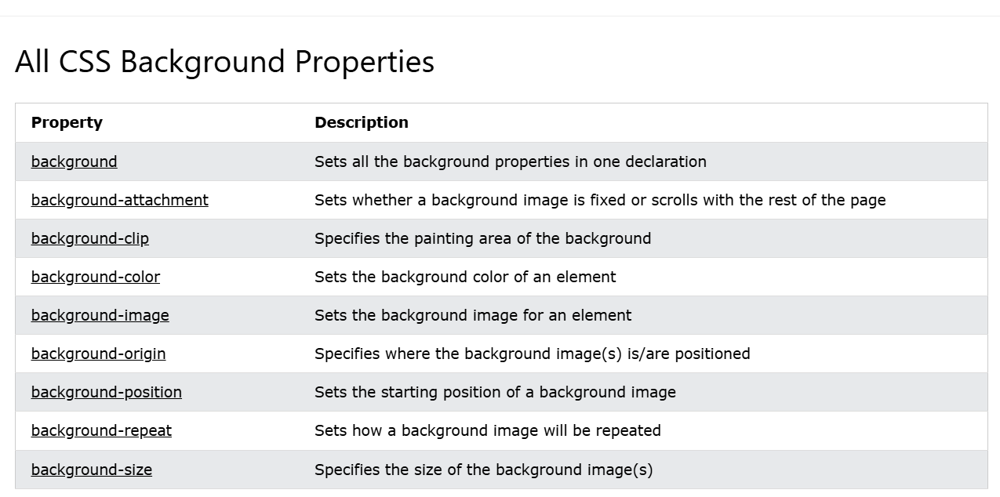
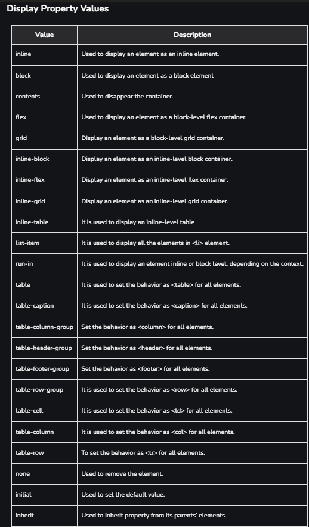

# CSS Introduction

CSS is the language we use to style a web page.

## What is CSS?

- **CSS** stands for *Cascading Style Sheets*.
- CSS describes how HTML elements are to be displayed on screen, paper, or in other media.
- CSS saves a lot of work. It can control the layout of multiple web pages all at once.
- External stylesheets are stored in `.css` files.

## Why Use CSS?

- **Separation of Content and Design:** Helps in keeping HTML clean and focusing only on structure.
- **Consistency:** Ensures a uniform look across multiple pages.
- **Efficient Maintenance:** Changes can be made easily by updating a single CSS file.
- **Faster Page Loading:** Reduces HTML file size and improves performance.

## Types of CSS

1. **Inline CSS**  
   - Applied directly within an HTML tag using the `style` attribute.  
   - Example:  

   ```html
   <p style="color: blue; font-size: 20px;">This is a blue paragraph.</p>
   ```

2. **Internal CSS**  
   - Defined inside a `<style>` tag within the HTML document.  
   - Example:  

   ```html
   <style>
       p {
           color: red;
           font-size: 18px;
       }
   </style>
   ```

3. **External CSS**  
   - Stored in a separate CSS file and linked to HTML using the `<link>` tag.  
   - Example:  

   ```html
   <link rel="stylesheet" href="styles.css">
   ```

## CSS Syntax

A CSS rule consists of:

- **Selector:** Specifies the HTML element to be styled.
- **Declaration Block:** Contains property-value pairs.

Example:

```css
p {
    color: green;
    font-size: 16px;
}
```

## Example of Using External CSS

**HTML (index.html):**

```html
<!DOCTYPE html>
<html lang="en">
<head>
    <meta charset="UTF-8">
    <meta name="viewport" content="width=device-width, initial-scale=1.0">
    <title>CSS Example</title>
    <link rel="stylesheet" href="styles.css">
</head>
<body>
    <h1>Welcome to CSS</h1>
    <p>This is an example of external CSS.</p>
</body>
</html>
```

**CSS (styles.css):**

```css
body {
    background-color: lightgray;
    font-family: Arial, sans-serif;
}

h1 {
    color: navy;
    text-align: center;
}

p {
    font-size: 18px;
    color: darkgreen;
}
```

# CSS Syntax Breakdown

## Selectors

Selectors are used to “select” the HTML element you want to style. They help in targeting elements by type, class, ID, or using universal selectors.

### Types of Selectors

1. **Type Selector:**  
   - Targets all elements of a specific type (e.g., `h1`, `p`, `div`).  
   - Example:  

   ```css
   h1 {
       font-family: Arial, sans-serif;
   }
   ```

2. **Class Selector:**  
   - Targets elements with a specific class.  
   - Example:  

   ```css
   .my-class {
       color: blue;
   }
   ```

3. **ID Selector:**  
   - Targets an element with a specific ID.  
   - Example:  

   ```css
   #my-id {
       background-color: yellow;
   }
   ```

4. **Universal Selector:**  
   - Targets all elements on a page.  
   - Example:  

   ```css
   * {
       margin: 0;
       padding: 0;
   }
   ```


## Properties

Properties define the aspects of the selected elements you want to style. Some commonly used CSS properties include:

- **color:** Defines the text color.  

  ```css
  p {
      color: red;
  }
  ```
  
- **background-color:** Sets the background color of an element.  

  ```css
  body {
      background-color: lightgray;
  }
  ```
  
- **font-size:** Specifies the size of the font.  

  ```css
  h1 {
      font-size: 24px;
  }
  ```
  
- **margin:** Defines the space around an element.  

  ```css
  div {
      margin: 20px;
  }
  ```
  
- **padding:** Defines the space between the content and border of an element.  

  ```css
  .container {
      padding: 15px;
  }
  ```

## Values

Values specify the details of the property applied. They can include:

- **Color names or codes:**  

  ```css
  color: blue; 
  color: #ff5733;
  ```
  
- **Size units (e.g., px, %, em):**  

  ```css
  font-size: 16px;
  width: 50%;
  ```

## Example of CSS Selectors in Action

```html
<!DOCTYPE html>
<html lang="en">
<head>
    <meta charset="UTF-8">
    <meta name="viewport" content="width=device-width, initial-scale=1.0">
    <title>CSS Selectors</title>
    <style>
        * {
            margin: 0;
            padding: 0;
        }
        h1 {
            font-size: 28px;
            color: darkblue;
        }
        .box {
            border: 2px solid black;
            padding: 20px;
        }
        #header {
            background-color: lightgray;
            text-align: center;
        }
    </style>
</head>
<body>
    <div id="header">
        <h1>Welcome to CSS</h1>
    </div>
    <div class="box">
        This is a styled box.
    </div>
</body>
</html>
```

## Additional Data

- **Grouping Selectors:**  
  - You can group multiple selectors to apply the same style to different elements.  

  ```css
  h1, h2, p {
      font-family: Arial, sans-serif;
  }
  ```

- **Pseudo-classes:**  
  - Special selectors to style elements based on their state.  

  ```css
  a:hover {
      color: green;
  }
  ```

- **Combining Selectors:**  
  - You can combine selectors for more specific styling.  

  ```css
  div.box p {
      font-style: italic;
  }
  ```

# CSS Colors

**Last Updated:** 19 Dec, 2024

CSS colors are used to set the color of different parts of a webpage, like text, background, and borders. This helps make the page look more attractive and easier to read. You can define colors using names, hex codes, RGB values, and more.

You can try different formats of colors here:

## Color Formats in CSS

| Color Format | Description |
|--------------|-------------|
| **Color Names** | Use predefined color names (e.g., red, blue, green) for simplicity. |
| **Hexadecimal (Hex) Codes** | Define colors using six-digit hex codes (e.g., `#FF5733`). |
| **RGB (Red, Green, Blue)** | Define colors using RGB values (e.g., `rgb(255, 0, 0)`). |
| **RGBA (Red, Green, Blue, Alpha)** | Extend RGB by adding an alpha (transparency) value (e.g., `rgba(255, 0, 0, 0.5)`). |
| **HSL (Hue, Saturation, Lightness)** | Define colors using HSL values (e.g., `hsl(120, 100%, 50%)`). |
| **HSLA (Hue, Saturation, Lightness, Alpha)** | Extend HSL by adding an alpha value for transparency (e.g., `hsla(120, 100%, 50%, 0.5)`). |

## Example Code

```html
<html>
<head>
    <style>
        .hex-example {
            background-color: #FF5733; /* Hexadecimal color */
        }
        .rgb-example {
            color: rgb(255, 0, 0); /* RGB color */
        }
        .rgba-example {
            color: rgba(0, 255, 0, 0.5); /* RGBA color with transparency */
        }
        .hsl-example {
            color: hsl(120, 100%, 50%); /* HSL color */
        }
        .hsla-example {
            color: hsla(120, 100%, 50%, 0.3); /* HSLA color with transparency */
        }
    </style>
</head>
<body>
    <div class="hex-example">This div has a Hexadecimal background color.</div>
    <div class="rgb-example">This text is in RGB red.</div>
    <div class="rgba-example">This text is in RGBA green with 50% transparency.</div>
    <div class="hsl-example">This text is in HSL green.</div>
    <div class="hsla-example">This text is in HSLA green with 30% opacity.</div>
</body>
</html>
```

### Explanation

**Background Color (background-color):**

```css
background-color: #FF5733; /* Applies a bright red-orange color using a hex code. */
padding: 20px; /* Adds space inside the div to make it more visible. */
```

**Text Color (color):**

```css
color: rgb(255, 0, 0); /* Sets the text color to red using RGB notation. */
font-size: 20px; /* Increases text size. */
```

**Border Color (border):(Will Discuss soon):**

```css
border: 5px solid rgba(0, 255, 0, 0.5); /* Green border with 50% transparency. */
padding: 10px;
margin: 10px;
```

**Hover Effects:(Will Discuss soon):**

```css
.hover-example {
    background-color: hsl(120, 100%, 50%); /* Bright green background. */
}
.hover-example:hover {
    background-color: hsla(120, 100%, 50%, 0.7); /* Transparent lighter green on hover. */
}
```

## Use Cases of CSS Colors with Code Examples

### 1. Background Colors

```html
<html>
<head>
    <style>
        .bg-example {
            background-color: #FF5733; /* Red-Orange background */
            padding: 20px;
            color: white;
        }
    </style>
</head>
<body>
    <div class="bg-example">This div has a warm background color!</div>
</body>
</html>
```

### 2. Text Colors

```html
<html>
<head>
    <style>
        .text-example {
            color: rgb(255, 0, 0); /* Red text */
            font-size: 20px;
        }
    </style>
</head>
<body>
    <p class="text-example">This text is in red.</p>
</body>
</html>
```

### 3. Border Colors (Will Discuss soon)

```html
<html>
<head>
    <style>
        .border-example {
            border: 5px solid rgba(0, 255, 0, 0.5); /* Semi-transparent green border */
            padding: 10px;
            margin: 10px;
        }
    </style>
</head>
<body>
    <div class="border-example">This div has a semi-transparent green border.</div>
</body>
</html>
```


# CSS Border

The **CSS border** properties allow you to specify the **style, width, and color** of an element's border.

The CSS border properties are used to define the **style, color, and size** of an element's border. The key border properties include:

- `border-style`
- `border-color`
- `border-width`
- `border-radius`

---

## CSS `border-style`

The `border-style` property specifies the type of border to be displayed.

### Allowed Values

- **dotted** - Defines a dotted border  
- **dashed** - Defines a dashed border  
- **solid** - Defines a solid border  
- **double** - Defines a double border  
- **groove** - Defines a 3D grooved border (effect depends on border-color)  
- **ridge** - Defines a 3D ridged border (effect depends on border-color)  
- **inset** - Defines a 3D inset border (effect depends on border-color)  
- **outset** - Defines a 3D outset border (effect depends on border-color)  
- **none** - No border  
- **hidden** - Hidden border  

---


## CSS `border-width`

The `border-width` property is used to set the thickness of the border. It can be defined in **pixels (px)** or using the predefined values:

- **thin**  
- **medium**  
- **thick**  

Example:

```css
border-width: 5px;  /* Sets a 5px thick border */
border-width: medium; /* Uses predefined width */
```

---

## CSS `border-color`

The `border-color` property allows you to set the color of the border using three methods:

1. **Name:** Specifies the color name (e.g., `"red"`).  
2. **RGB:** Specifies the RGB value (e.g., `"rgb(255,0,0)"`).  
3. **Hex:** Specifies the hex value (e.g., `"#ff0000"`).  

Example:

```css
border-color: blue; /* Using color name */
border-color: rgb(0, 255, 0); /* Using RGB value */
border-color: #0000ff; /* Using HEX value */
```

---

## Example Code

```html
<!DOCTYPE html>
<html>
  <head>
    <title>CSS Border Example</title>
    <style>
        h1 {
            /* Example using individual properties */
            /* border-width: 3px;
            border-style: solid dotted dashed inset;
            border-color: red; */

            /* Shorthand notation */
            /* border: 3px solid red; */

            border-bottom: 3px solid red;
            border-top: 3px dashed green;
        }
    </style>
  </head>

  <body>
    <h1>Uzair : CSS Border</h1>

    <p>
      Lorem ipsum dolor sit amet, consectetur adipiscing elit. Donec quis lectus ac ipsum lobortis malesuada vitae vitae lorem. Vestibulum euismod, lacus a dictum ultrices, lorem libero porttitor dui, in feugiat sem lacus eget elit.
    </p>

    <p>
      Lorem ipsum dolor sit amet, consectetur adipiscing elit. Donec quis lectus ac ipsum lobortis malesuada vitae vitae lorem. Vestibulum euismod, lacus a dictum ultrices, lorem libero porttitor dui, in feugiat sem lacus eget elit.
    </p>
  </body>
</html>
```

---

## Explanation

- The **`border-bottom`** property applies a **solid red** border of `3px` to the bottom of the heading.
- The **`border-top`** property applies a **dashed green** border of `3px` to the top of the heading.
- The paragraph text provides sample content for layout demonstration.


# CSS Outline

The CSS `outline` property allows you to draw a line around an element, outside its border, to make it stand out. Unlike borders, outlines do not occupy space or affect the element's dimensions; they are drawn over the element and may overlap other content. ([W3Schools.com](https://www.w3schools.com/css/css_outline.asp?utm_source=chatgpt.com))

**Key Differences Between Borders and Outlines:**

- **Position:** Outlines are drawn outside the element's border, whereas borders are part of the element's box model.
- **Space:** Outlines do not take up space or affect the layout; borders do.
- **Customization:** Outlines cannot be applied to specific sides of an element; they encompass all sides.

**CSS Outline Properties:**

1. **`outline-style`:** Specifies the style of the outline. Possible values include:
   - `dotted`
   - `dashed`
   - `solid`
   - `double`
   - `groove`
   - `ridge`
   - `inset`
   - `outset`
   - `none`
   - `hidden`

2. **`outline-width`:** Sets the width of the outline. It can be specified in length units (e.g., `px`, `em`) or by using predefined values:
   - `thin`
   - `medium`
   - `thick`

3. **`outline-color`:** Defines the color of the outline. It accepts color names, HEX values, RGB, or HSL values.

4. **`outline-offset`:** Specifies the space between the outline and the border edge. This property creates a gap between the border and the outline, enhancing visual separation.

5. **`outline`:** A shorthand property to set `outline-width`, `outline-style`, and `outline-color` in a single declaration.

**Example Usage:**

```html
<!DOCTYPE html>
<html>
<head>
  <title>CSS Outline Example</title>
  <style>
    p {
      border: 3px solid red;
      outline: 2px dashed green;
      outline-offset: 4px;
    }
  </style>
</head>
<body>
  <h1>CSS Outline Example</h1>
  <p>
    This paragraph has a red border and a green dashed outline with an offset.
  </p>
</body>
</html>
```

In this example, the paragraph has a solid red border and a dashed green outline. The `outline-offset` property creates a 4-pixel space between the border and the outline, making the outline more distinct.

**Accessibility Consideration:**

Be cautious when removing outlines, especially on focusable elements like links or buttons. Outlines are crucial for keyboard navigation and accessibility. If you remove the default outline (e.g., using `outline: none;`), ensure you provide an alternative visual indicator for focus states to maintain usability for all users. ([MDN Web Docs](https://developer.mozilla.org/en-US/docs/Web/CSS/outline?utm_source=chatgpt.com))

By understanding and utilizing the CSS outline properties, you can effectively highlight elements on your webpage without affecting their layout or dimensions.

# CSS Units

**Last Updated: 14 Jan, 2025**

CSS units define the size of elements, with absolute units (like `px`, `cm`) having fixed values and relative units (like `em`, `rem`, `%`, `vh`) depending on factors like the viewport or parent elements.

There are two types of units: **Absolute** and **Relative**.

---

## Absolute Units

Absolute units in CSS, such as `px`, `cm`, and `mm`, have fixed values and do not change based on the viewport or parent elements. They are used when precise, unchanging measurements are needed for elements.

### 1. cm (Centimeter)

A centimeter (`cm`) is a length unit in the SI system, derived from the meter (`m`), with:

- **1 m = 100 cm**
  
```html
<style>
    p {
        font-size: 2cm;
        color: green;
    }
</style>
```

---

### 2. mm (Millimeter)

The millimeter (`mm`), introduced during the French Revolution’s metric system, became part of the SI system.

- **1 cm = 10 mm**
- **1 mm = 1/10 cm**

```html
<style>
    p {
        font-size: 2mm;
        color: green;
    }
</style>
```

---

### 3. in (Inch)

The inch originated from ancient human measurements and was standardized in 1959.

- **1 inch = 2.54 cm = 25.4 mm**

```html
<style>
    p {
        font-size: 1in;
        color: green;
    }
</style>
```

---

### 4. px (Pixel)

A pixel (`px`) is the smallest unit on a digital screen.

- **1 px = 0.26 mm**

```html
<style>
    p {
        font-size: 23px;
        color: green;
    }
</style>
```

---

### 5. pt (Point)

A point (`pt`) is a typography unit, commonly used in print.

- **1 pt = 1/72 inch**
- **1 pt = 1.33 px**

```html
<style>
    p {
        font-size: 100pt;
        color: green;
    }
</style>
```

---

### 6. pc (Pica)

A pica (`pc`) is equal to 12 points or 1/6 of an inch.

- **1 pc = 12 pt = 15.96 px**

```html
<style>
    p {
        font-size: 12pc;
        color: green;
    }
</style>
```

---

## Relative Units

Relative units depend on the parent element or viewport size, making them useful for responsive designs.

### 1. em

The `em` unit refers to the font-size of its parent element.

```html
<style>
    .ok {
        font-size: 20px;
    }
    .para {
        font-size: 2em;
    }
</style>
```

> If the parent font-size is 20px, then `2em` means 40px.

---

### 2. rem

The `rem` unit is based on the root `<html>` font-size.

```html
<style>
    html {
        font-size: 25px;
    }
    .para {
        font-size: 2rem;
        color: red;
    }
</style>
```

> If the root font-size is 25px, then `2rem` means 50px.

---

### 3. vw (Viewport Width)

`vw` depends on the viewport width.

```html
<style>
    .para {
        height: 10vw;
        width: 50vw;
        border: 2px solid black;
        background-color: chocolate;
    }
</style>
```

---

### 4. vh (Viewport Height)

The `vh` unit represents 1% of the viewport height.

```html
<style>
    .full-height {
        height: 100vh;
        background-color: lightblue;
        display: flex;
        justify-content: center;
        align-items: center;
    }
</style>
```

---

### 5. % (Percentage)

The `%` unit is relative to the parent element’s size.

```html
<style>
    .container {
        width: 300px;
        height: 200px;
        background-color: lightgreen;
    }
    .child {
        width: 50%;
        height: 50%;
        background-color: lightcoral;
    }
</style>
```

---

### 6. vmin

The `vmin` unit is based on the smaller of the viewport's width or height.

```html
<style>
    div {
        height: 20vmin;
        width: 20vmin;
        background-color: blueviolet;
    }
</style>
```

---

### 7. vmax

The `vmax` unit is based on the larger viewport dimension.

```html
<style>
    div {
        height: 10vmax;
        width: 10vmax;
        background-color: cadetblue;
    }
</style>
```

---

### 8. ch

The `ch` unit represents the width of the “0” character of the current font.

```html
<style>
    .small {
        font-family: monospace;
        font-size: 25px;
        height: 10ch;
        width: 10ch;
        background-color: cornflowerblue;
    }
</style>
```

---

### 9. ex

The `ex` unit is based on the height of the letter “x” in the current font.

```html
<style>
    .small {
        font-family: monospace;
        font-size: 25px;
        height: 10ex;
        width: 10ex;
        background-color: cornflowerblue;
    }
</style>
```

---

### 10. lh (Line Height)

The `lh` unit depends on the line-height of the element.

```html
<style>
    .small {
        font-family: sans-serif;
        font-size: 25px;
        line-height: 10;
        height: 2lh;
        width: 2lh;
        background-color: aquamarine;
    }
</style>
```

---

## Difference Between Absolute and Relative Units in CSS

| **Feature**        | **Absolute Units**          | **Relative Units**               |
|-------------------|---------------------------|----------------------------------|
| Definition         | Fixed values               | Based on parent/viewport         |
| Responsiveness     | Not responsive             | Responsive                       |
| Common Examples   | `cm`, `mm`, `px`            | `em`, `rem`, `%`, `vh`, `vw`     |
| Use Case           | Print, fixed layouts       | Web, responsive designs          |

---

**Conclusion:**  
CSS units play a vital role in web design, allowing for both fixed and flexible layouts depending on the requirements.


# CSS Padding

The CSS padding properties are used to generate space around an element's content, inside of any defined borders.

With CSS, you have full control over the padding. There are properties for setting the padding for each side of an element (top, right, bottom, and left).

## CSS Padding Properties

| Property        | Description                                                                 |
|-----------------|-----------------------------------------------------------------------------|
| `padding`       | It is used to set all the padding properties in one declaration.            |
| `padding-left`  | It is used to set left padding of an element.                               |
| `padding-right` | It is used to set right padding of an element.                              |
| `padding-top`   | It is used to set top padding of an element.                                |
| `padding-bottom`| It is used to set bottom padding of an element.                             |

### Padding with Multiple Values

- If the padding property has **three values**:
  
  ```css
  padding: 25px 50px 75px;
  ```
  - Top padding is `25px`
  - Right and left paddings are `50px`
  - Bottom padding is `75px`

- If the padding property has **two values**:

  ```css
  padding: 25px 50px;
  ```
  - Top and bottom paddings are `25px`
  - Right and left paddings are `50px`

- If the padding property has **one value**:

  ```css
  padding: 25px;
  ```
  - All four paddings are `25px`

## Example

```html
<html>
  <head>
    <title>CSS Padding</title>
    <style>
        .test {
            border: 2px solid black;
            padding: 20px 50px;
        }
    </style>
  </head>

  <body>
    <h1>Uzair : CSS Padding</h1>

    <div class="test">
        Suspendisse molestie nibh massa, eget convallis dolor convallis ut. Aenean efficitur nec augue at vehicula. Nunc tempor ac ante a aliquam. Duis lacinia dolor in libero ornare, at aliquam metus posuere. Phasellus porttitor, diam et semper tempus, nisl nunc ullamcorper sem, in viverra ex ligula a lacus. Donec ac sapien urna. Sed id est orci. Interdum et malesuada fames ac ante ipsum primis in faucibus. Mauris ex metus, tincidunt non massa volutpat, pharetra vulputate libero. Donec vehicula dolor sit amet lacinia viverra. Pellentesque sed luctus sem. Duis turpis purus, vestibulum egestas posuere cursus, imperdiet in lacus. Proin vehicula semper aliquam. Maecenas sodales sagittis lobortis. Etiam felis massa, tempus fermentum felis ut, pretium mattis dui.
    </div>
  </body>
</html>
```

---


# CSS Margin

The CSS Margin property is used to define the space around elements. It is completely transparent and doesn't have any background color. It clears an area around the element. Top, bottom, left, and right margins can be changed independently using separate properties. You can also change all properties at once by using the shorthand margin property.

CSS has properties for specifying the margin for each side of an element:

- `margin-top`
- `margin-right`
- `margin-bottom`
- `margin-left`

## Margin - Shorthand Property

To shorten the code, it is possible to specify all the margin properties in one property.

The margin property is a shorthand property for the following individual margin properties:

- If the margin property has **four values**:

  ```css
  margin: 25px 50px 75px 100px;
  ```
  - Top margin is `25px`
  - Right margin is `50px`
  - Bottom margin is `75px`
  - Left margin is `100px`

- If the margin property has **three values**:

  ```css
  margin: 25px 50px 75px;
  ```
  - Top margin is `25px`
  - Right and left margins are `50px`
  - Bottom margin is `75px`

- If the margin property has **two values**:

  ```css
  margin: 25px 50px;
  ```
  - Top and bottom margins are `25px`
  - Right and left margins are `50px`

- If the margin property has **one value**:

  ```css
  margin: 25px;
  ```
  - All four margins are `25px`

## Example

```html
<html>
  <head>
    <title>CSS Margin</title>
    <style>
      h1 {
        margin: 0 0 50px;
      }
      #first {
        border: 2px solid black;
        margin-bottom: 30px;
      }

      #second {
        border: 2px solid red;
        margin: 10px 200px 10px 300px;
      }

      #third {
        width: 500px;
        border: 2px solid green;
        margin: 10px auto;
      }
    </style>
  </head>

  <body>
    <h1>Uzair : CSS Margin</h1>

    <div id="first">
        Lorem ipsum dolor sit amet, consectetur adipiscing elit. Donec quis lectus ac ipsum lobortis malesuada vitae vitae lorem. Vestibulum euismod, lacus a dictum ultrices, lorem libero porttitor dui, in feugiat sem lacus eget elit. Nunc ultricies varius ligula in egestas. Nunc blandit malesuada nisi ut dapibus. Cras in malesuada lectus, eu rhoncus erat. Vivamus fermentum nisi malesuada mauris accumsan, cursus convallis dolor dictum. Sed hendrerit dictum dignissim. Maecenas eget luctus neque, at sollicitudin metus. Etiam urna turpis, aliquam quis semper at, rutrum et risus. Duis laoreet, nulla non maximus laoreet, risus erat mollis augue, sit amet consequat magna orci et dolor. Praesent fermentum nisl quis urna gravida, ac lacinia velit pretium. Aliquam at arcu et erat porta convallis ut non turpis.
    </div>

    <div id="second">
        Lorem ipsum dolor sit amet, consectetur adipiscing elit. Donec quis lectus ac ipsum lobortis malesuada vitae vitae lorem. Vestibulum euismod, lacus a dictum ultrices, lorem libero porttitor dui, in feugiat sem lacus eget elit. Nunc ultricies varius ligula in egestas. Nunc blandit malesuada nisi ut dapibus. Cras in malesuada lectus, eu rhoncus erat. Vivamus fermentum nisi malesuada mauris accumsan, cursus convallis dolor dictum. Sed hendrerit dictum dignissim. Maecenas eget luctus neque, at sollicitudin metus. Etiam urna turpis, aliquam quis semper at, rutrum et risus. Duis laoreet, nulla non maximus laoreet, risus erat mollis augue, sit amet consequat magna orci et dolor. Praesent fermentum nisl quis urna gravida, ac lacinia velit pretium. Aliquam at arcu et erat porta convallis ut non turpis.
    </div>
    Lorem ipsum dolor sit amet, consectetur adipiscing elit.

    <div id="third">
        Lorem ipsum dolor sit amet, consectetur adipiscing elit. Donec quis lectus ac ipsum lobortis malesuada vitae vitae lorem. Vestibulum euismod, lacus a dictum ultrices, lorem libero porttitor dui, in feugiat sem lacus eget elit. Nunc ultricies varius ligula in egestas. Nunc blandit malesuada nisi ut dapibus. Cras in malesuada lectus, eu rhoncus erat. Vivamus fermentum nisi malesuada mauris accumsan, cursus convallis dolor dictum. Sed hendrerit dictum dignissim. Maecenas eget luctus neque, at sollicitudin metus. Etiam urna turpis, aliquam quis semper at, rutrum et risus. Duis laoreet, nulla non maximus laoreet, risus erat mollis augue, sit amet consequat magna orci et dolor. Praesent fermentum nisl quis urna gravida, ac lacinia velit pretium. Aliquam at arcu et erat porta convallis ut non turpis.
    </div>
  </body>
</html>
```


# CSS Height/Width

The CSS `height` and `width` properties are used to set the height and width of an element. The height and width properties do not include padding, borders, or margins. It sets the height/width of the area inside the padding, border, and margin of the element.

## CSS height and width Values

The `height` and `width` properties may have the following values:

- `auto`: This is default. The browser calculates the height and width.
- `length`: Defines the height/width in px, cm, etc.
- `%`: Defines the height/width in percent of the containing block.
- `initial`: Sets the height/width to its default value.
- `inherit`: The height/width will be inherited from its parent value.

```html
<html>
  <head>
    <title>Height & Width</title>
    <style>
        #first{
            width: 700px;
            height: 200px;
            border: 1px solid red;
        }
    </style>
  </head>

  <body>
    <h1>Yahoo Baba : CSS Width & Height</h1>

    <div id="first">
        Lorem ipsum dolor sit amet, consectetur adipiscing elit. Donec quis lectus ac ipsum lobortis malesuada vitae vitae lorem. Vestibulum euismod, lacus a dictum ultrices, lorem libero porttitor dui, in feugiat sem lacus eget elit. Nunc ultricies varius ligula in egestas. Nunc blandit malesuada nisi ut dapibus. Cras in malesuada lectus, eu rhoncus erat. Vivamus fermentum nisi malesuada mauris accumsan, cursus convallis dolor dictum. Sed hendrerit dictum dignissim. Maecenas eget luctus neque, at sollicitudin metus. Etiam urna turpis, aliquam quis semper at, rutrum et risus. Duis laoreet, nulla non maximus laoreet, risus erat mollis augue, sit amet consequat magna orci et dolor. Praesent fermentum nisl quis urna gravida, ac lacinia velit pretium. Aliquam at arcu et erat porta convallis ut non turpis.
        Lorem ipsum dolor sit amet, consectetur adipiscing elit. Donec quis lectus ac ipsum lobortis malesuada vitae vitae lorem. Vestibulum euismod, lacus a dictum ultrices, lorem libero porttitor dui, in feugiat sem lacus eget elit. Nunc ultricies varius 
    </div>


  </body>
</html>
```


# CSS Min-Height/Max-Height

The `min-height` property defines the minimum height of an element.

- If the content is smaller than the minimum height, the minimum height will be applied.
- If the content is larger than the minimum height, the `min-height` property has no effect.

The `max-height` property defines the maximum height of an element.

- If the content is larger than the maximum height, it will overflow. How the container will handle the overflowing content is defined by the `overflow` property.
- If the content is smaller than the maximum height, the `max-height` property has no effect.

```html
<html>
  <head>
    <title>Min-Height & Max-Height</title>
    <style>
        #first{
            width: 700px;
            min-height: 200px;
            max-height: 500px;
            border: 3px solid red;
        }
    </style>
  </head>

  <body>
    <h1>Yahoo Baba : CSS Min-Height & Min-Height</h1>

    <div id="first">
        Lorem ipsum dolor sit amet, consectetur adipiscing elit. Donec quis lectus ac ipsum lobortis malesuada vitae vitae lorem. Vestibulum euismod, lacus a dictum ultrices, lorem libero porttitor dui, in feugiat sem lacus eget elit. Nunc ultricies varius ligula in egestas. Nunc blandit malesuada nisi ut dapibus. Cras in malesuada lectus, eu rhoncus erat. Vivamus fermentum nisi malesuada mauris accumsan, cursus convallis dolor dictum. Sed hendrerit dictum dignissim. Maecenas eget luctus neque, at sollicitudin metus. Etiam urna turpis, aliquam quis semper at, rutrum et risus. Duis laoreet, nulla non maximus laoreet, risus erat mollis augue, sit amet consequat magna orci et dolor. Praesent fermentum nisl quis urna gravida, ac lacinia velit pretium. Aliquam at arcu et erat porta convallis ut non turpis.
        Lorem ipsum dolor sit amet, consectetur adipiscing elit. Donec quis lectus ac ipsum lobortis malesuada vitae vitae lorem. Vestibulum euismod, lacus a dictum ultrices, lorem libero porttitor dui, in feugiat sem lacus eget elit. Nunc ultricies varius 
        Lorem ipsum dolor sit amet, consectetur adipiscing elit. Donec quis lectus ac ipsum lobortis malesuada vitae vitae lorem. Vestibulum euismod, lacus a dictum ultrices, lorem libero porttitor dui, in feugiat sem lacus eget elit. Nunc ultricies varius ligula in egestas. Nunc blandit malesuada nisi ut dapibus. Cras in malesuada lectus, eu rhoncus erat. Vivamus fermentum nisi malesuada mauris accumsan, cursus convallis dolor dictum. Sed hendrerit dictum dignissim. Maecenas eget luctus neque, at sollicitudin metus. Etiam urna turpis, aliquam quis semper at, rutrum et risus. Duis laoreet, nulla non maximus laoreet, risus erat mollis augue, sit amet consequat magna orci et dolor. Praesent fermentum nisl quis urna gravida, ac lacinia velit pretium. Aliquam at arcu et erat porta convallis ut non turpis.
    </div>


  </body>
</html>


```


# CSS Min-Width/Max-Width

The `min-width` property defines the minimum width of an element.

- If the content is smaller than the minimum width, the minimum width will be applied.
- If the content is larger than the minimum width, the `min-width` property has no effect.

The `max-width` property defines the maximum width of an element.

- If the content is larger than the maximum width, it will automatically change the height of the element.
- If the content is smaller than the maximum width, the `max-width` property has no effect.

```html
<html>
  <head>
    <title>Min-Width & Max-Width</title>
    <style>
        #first{
            border: 3px solid red;
            min-width: 300px;
            max-width: 800px;
        }
        img{
            width: 100%;
        }
    </style>
  </head>

  <body>
    <h1>Yahoo Baba : CSS Min-Width & Min-Width</h1>

    <div id="first">
        <!-- random image from unsplash.com -->
        
        Lorem ipsum dolor sit amet, consectetur adipiscing elit. Donec quis lectus ac ipsum lobortis malesuada vitae vitae lorem. Vestibulum euismod, lacus a dictum ultrices, lorem libero porttitor dui, in feugiat sem lacus eget elit. Nunc ultricies varius ligula in egestas. Nunc blandit malesuada nisi ut dapibus. Cras in malesuada lectus, eu rhoncus erat. Vivamus fermentum nisi malesuada mauris accumsan, cursus convallis dolor dictum. Sed hendrerit dictum dignissim. Maecenas eget luctus neque, at sollicitudin metus. Etiam urna turpis, aliquam quis semper at, rutrum et risus. Duis laoreet, nulla non maximus laoreet, risus erat mollis augue, sit amet consequat magna orci et dolor. Praesent fermentum nisl quis urna gravida, ac lacinia velit pretium. Aliquam at arcu et erat porta convallis ut non turpis.
    </div>
  </body>
</html>

```


# CSS Box Model
**Last Updated:** 04 Jan, 2025

The CSS Box Model defines how elements are sized, positioned, and rendered on a webpage. When a browser loads an HTML document, it creates a DOM tree and assigns a box to each element. This box calculates the element’s dimensions and position relative to its parent or the root `<html>` element, ensuring accurate layout and spacing.

## Box Model Component Layout
1. **Content**: The area where text or other content is displayed.
2. **Padding**: Space between the content and the element’s border.
3. **Border**: A frame that wraps around the padding and content.
4. **Margin**: Space between the element’s border and neighboring elements.


### 1. Content Area
The content area is the central part of the CSS box model, containing the main content (e.g., text, images, videos, or elements like `<p>` or `<span>`).  
It can be styled with CSS properties like height and width.  
The content edge refers to the four edges of the content area:
- Left content edge
- Right content edge
- Top content edge
- Bottom content edge

### 2. Padding Area
The padding area is the space between the content and the border of an element.  
It includes the areas highlighted in light green and skin color in the example.  
The distance between the content edge and the border is the padding.  
The border marks the end of the padding area.  
The padding area contributes to the element’s total dimensions.  
Padding can be adjusted using CSS properties.  
It works similarly with `box-sizing: content-box` and `box-sizing: border-box`, but with slight calculation differences.

### 3. Border Area
The area that marks the end of an element is called the border, which acts as the outer fencing for the element.  
The default border properties are provided in CSS to control the thickness of this outer fencing.  
The border area also adds to the complete height and width of the element.  
The more the border width, the more the height or width of the element increases.  
In the above image, the area marked with skin color is called the border area.

### 4. Margin Area
The area outside the border of an element is called the margin area.  
This area depends on the parent of the element.  
The distance between the border of the parent element and the border of the child element is called the margin.  
CSS provides certain margin properties to control this scenario.

## Box Sizing Property in CSS
There are two types of `box-sizing` properties in CSS:

### 1. Content-Box (default property)
When the user sets the value of the `box-sizing` property for an element as `content-box`, or if the user does not set it, it remains by default as `content-box`.  
In this case, the actual height and width of the element include the dimensions of the content area as well as the padding area, which adds to the final dimensions of the element.

```html
<style>
    div {
        height: 200px;
        width: 200px;
        box-sizing: content-box;
        padding-left: 20px;
        padding-right: 20px;
        border-left: 2px solid red;
        border-right: 2px solid red;
    }
</style>
```
This code will create a box model with a border line width of 0.4px always, a border area of 1.6px, and a padding area of 20px width on both sides of the content area.

**Content Area (Width):**  
The width of the content area is fixed at 200px.

**Padding:**
- Padding Left: 20px
- Padding Right: 20px
- Total padding width: 20px + 20px = 40px

**Border:**
- Line Width of Border: 0.4px
- Area of Border: 1.6px (left) + 1.6px (right) = 3.2px
- Border width for both sides: 3.2px

**Total Width Calculation:**
- Formula: (Padding-Left + Padding-Right + Border-Area-Left + Border-Area-Right) + Content Area Width
- Total Width = (20px + 20px + 1.6px + 1.6px) + 200px = 243.2px

Thus, the total width of the element becomes 243.2px.

### 2. Border-Box
When the `box-sizing` property is set as `border-box`, the actual dimensions of the element remain the same as the user-defined dimensions.  
The difference is that the size of the content area gets altered to accommodate the padding area and the border area, ensuring the final size is equal to the user-defined dimensions.

```html
<style>
    div {
        height: 200px;
        width: 200px;
        box-sizing: border-box;
        padding-left: 20px;
        padding-right: 20px;
        border-left: 2px solid red;
        border-right: 2px solid red;
    }
</style>
```
This code will create a box model by altering the content area width to accommodate the padding and the border area with the border line-width.

**User-Entered Width:**  
The width entered by the user is 200px, which applies to the content area only when `box-sizing: content-box` is used.

**Adjusting Content Area Width:**  
To ensure the total width remains 200px, the extra width from padding and borders (40px + 3.2px = 43.2px) is subtracted from the total width.  
New content area width: 200px – 43.2px = 156.8px.  
The final total width is: 156.8px (content area) + 40px (padding) + 3.2px (border) = 200px, ensuring the user’s entered width remains unchanged.

## Use Cases of CSS Box Model

### 1. Default box-sizing: content-box
Default behavior where padding and borders are added outside the content area, leading to an increased overall width/height.

```html
<style>
    div {
        width: 200px;
        padding: 20px;
        border: 5px solid black;
        box-sizing: content-box;
        background-color: lightgreen;
    }
</style>
```
The total width of the element will be 200px + 20px (left) + 20px (right) + 5px (left border) + 5px (right border) = 250px.

### 2. Using box-sizing: border-box for Consistent Sizing
Ensure the padding and border are included within the specified width/height to maintain a fixed size for layout consistency.

```html
<style>
    div {
        width: 200px;
        padding: 20px;
        border: 5px solid black;
        box-sizing: border-box;
        background-color: lightcoral;
    }
</style>
```
The total width remains 200px, with padding and border included in the 200px size.

### 3. Setting box-sizing for All Elements
Apply `box-sizing: border-box` to all elements globally to simplify layout calculations and prevent unexpected element size changes.

```html
<style>
    * {
        box-sizing: border-box;
    }
    div {
        width: 100%;
        padding: 20px;
        border: 2px solid blue;
        background-color: lightyellow;
    }
</style>
```
All elements are sized consistently, with padding and borders included inside the width/height.

### 4. Fixed Layout with box-sizing: border-box
Creating a fixed-size element with padding and border without altering the layout dimensions.

```html
<style>
    div {
        width: 300px;
        height: 150px;
        padding: 10px;
        border: 10px solid green;
        box-sizing: border-box;
        background-color: lightblue;
    }
</style>
```

### 5. Creating a Responsive Box with box-sizing
Ensuring that padding and borders do not cause layout issues in a responsive design.

```html
<style>
    * {
        box-sizing: border-box;
    }
    .container {
        max-width: 100%;
        padding: 20px;
        border: 5px solid purple;
        background-color: lightgreen;
    }
</style>
```
The element resizes according to the screen width, with padding and borders included in the total size, avoiding overflow.


# CSS Overflow

The overflow property specifies whether to clip the content or to add scrollbars when the content of an element is too big to fit in the specified area.

The overflow property has the following values:

- **visible** - Default. The overflow is not clipped. The content renders outside the element's box.
- **hidden** - The overflow is clipped, and the rest of the content will be invisible.
- **scroll** - The overflow is clipped, and a scrollbar is added to see the rest of the content.
- **auto** - Similar to scroll, but it adds scrollbars only when necessary.

```html
<html>
  <head>
    <title>Overflow</title>
    <style>
        #box{
            width: 250px;
            height: 250px;
            border: 2px solid black;
            overflow-x: scroll;
        }
    </style>
  </head>
  <body>
    <h1>Yahoo Baba : CSS Overflow</h1>
    <div id="box">
      
      Lorem ipsum dolor sit amet, consectetur adipiscing elit. Donec quis lectus ac ipsum lobortis malesuada vitae vitae lorem. Vestibulum euismod, lacus a dictum ultrices, lorem libero porttitor dui, in feugiat sem lacus eget elit. Nunc ultricies varius ligula in egestas. Nunc blandit malesuada nisi ut dapibus. Cras in malesuada lectus, eu rhoncus erat. Vivamus fermentum nisi malesuada mauris accumsan, cursus convallis dolor dictum. Sed hendrerit dictum dignissim. Maecenas eget luctus neque, at sollicitudin metus. Etiam urna turpis, aliquam quis semper at, rutrum et risus. Duis laoreet, nulla non maximus laoreet, risus erat mollis augue, sit amet consequat magna orci et dolor. Praesent fermentum nisl quis urna gravida, ac lacinia velit pretium. Aliquam at arcu et erat porta convallis ut non turpis.
    </div>
  </body>
</html>
```

### Additional Data:

- The `overflow-x` property in the style specifies that the horizontal overflow will show a scrollbar if the content overflows the container's width.
- To apply vertical scrolling, the `overflow-y` property could be used. For example, you can set `overflow-y: scroll;` for vertical scrolling in the container.


# CSS Border-Radius

The `border-radius` property defines the radius of the element's corners.

**Tip**: This property allows you to add rounded corners to elements!

This property can have from one to four values. Here are the rules:

- **Four values** - `border-radius: 15px 50px 30px 5px;` (first value applies to top-left corner, second value applies to top-right corner, third value applies to bottom-right corner, and fourth value applies to bottom-left corner):
  
- **Three values** - `border-radius: 15px 50px 30px;` (first value applies to top-left corner, second value applies to top-right and bottom-left corners, and third value applies to bottom-right corner):
  
- **Two values** - `border-radius: 15px 50px;` (first value applies to top-left and bottom-right corners, and the second value applies to top-right and bottom-left corners):
  
- **One value** - `border-radius: 15px;` (the value applies to all four corners, which are rounded equally):

```html
<html>
  <head>
    <title>Box-Radius</title>
    <style>
        #box{
            width: 300px;
            border: 2px solid black;
            padding: 25px;
            /* border-top-left-radius: 30px;
            border-top-right-radius: 50px;
            border-bottom-right-radius: 50px;
            border-bottom-left-radius: 30px; */

            /*shorthand*/
            border-radius: 50%;

            /*shorthand with prefix*/
            /* -webkit-border-radius: 30px 50px;
            -moz-border-radius: 30px 50px; */
        }
        #box2{
            width: 150px;
            height: 150px;
            border: 2px solid red;
            border-radius: 50%;
            background-color: pink;
        }
    </style>
  </head>

  <body>
    <h1>Yahoo Baba : Box-Radius</h1>

    <div id="box">
      Lorem ipsum dolor sit amet, consectetur adipiscing elit. Donec quis lectus ac ipsum lobortis malesuada vitae vitae lorem. Vestibulum euismod, lacus a dictum ultrices, lorem libero porttitor dui, in feugiat sem lacus eget elit. Nunc ultricies varius ligula in egestas. Nunc blandit malesuada nisi ut dapibus. Cras in malesuada lectus, eu rhoncus erat. Vivamus fermentum nisi malesuada mauris accumsan, cursus convallis dolor dictum. Sed hendrerit dictum dignissim. Maecenas eget luctus neque, at sollicitudin metus. Etiam urna turpis, aliquam quis semper at, rutrum et risus. Duis laoreet, nulla non maximus laoreet, risus erat mollis augue, sit amet consequat magna orci et dolor. Praesent fermentum nisl quis urna gravida, ac lacinia velit pretium. Aliquam at arcu et erat porta convallis ut non turpis.
    </div>

    <div id="box2"></div>
  </body>
</html>
```

### Additional Data:

- The `border-radius: 50%;` is shorthand for making a circular shape, which works best on square elements (like the `#box2` div in the example).
- The property can also be prefixed for older browsers, such as `-webkit-border-radius` and `-moz-border-radius`.


# CSS Box-Shadow

The `box-shadow` CSS property adds shadow effects around an element’s frame. You can set multiple effects separated by commas. A box shadow is described by X and Y offsets relative to the element, blur and spread radius, and color. In its simplest use, you only specify a horizontal and a vertical shadow. The default color of the shadow is the current text-color. Here is an example of how to specify a horizontal and a vertical shadow:

```html
<html>
  <head>
    <title>Box-Shadow</title>
    <style>
        #box{
            width: 350px;
            height: 350px;
            margin: 50px 0 0 100px;
            border: 2px solid black;
            background-color: pink;
            box-shadow: 10px 10px 3px red inset;
            -moz-box-shadow: 10px 10px 3px red inset;
            -webkit-box-shadow: 10px 10px 3px red inset;
        }
    </style>
  </head>
  <body>
    <h1>Yahoo Baba : CSS Box-Shadow</h1>
    <div id="box">
      Lorem ipsum dolor sit amet, consectetur adipiscing elit. Donec quis lectus ac ipsum lobortis malesuada vitae vitae lorem. Vestibulum euismod, lacus a dictum ultrices, lorem libero porttitor dui, in feugiat sem lacus eget elit. Nunc ultricies varius ligula in egestas. Nunc blandit malesuada nisi ut dapibus. Cras in malesuada lectus, eu rhoncus erat. Vivamus fermentum nisi malesuada mauris accumsan, cursus convallis dolor dictum. Sed hendrerit dictum dignissim. Maecenas eget luctus neque, at sollicitudin metus. Etiam urna turpis, aliquam quis semper at, rutrum et risus. Duis laoreet, nulla non maximus laoreet, risus erat mollis augue, sit amet consequat magna orci et dolor. Praesent fermentum nisl quis urna gravida, ac lacinia velit pretium. Aliquam at arcu et erat porta convallis ut non turpis.
    </div>
  </body>
</html>
```

### Additional Data:

- The `box-shadow` property can also take multiple values for multiple shadows, separated by commas. For example: `box-shadow: 10px 10px 5px red, -10px -10px 5px blue;`
- The `inset` keyword makes the shadow appear inside the element, while by default the shadow appears outside.
- For better browser support, the property has vendor-specific prefixes: `-moz-box-shadow` for Firefox and `-webkit-box-shadow` for Webkit-based browsers like Chrome and Safari.


# CSS Float

The `float` property is a positioning property. It is used to push an element to the left or right, allowing other elements to wrap around it. It is generally used with images and layouts.

## How it works

- Elements are floated only horizontally, meaning they can only float to the left or right, not up or down.
- A floated element may be moved as far to the left or the right as possible. 
- The elements after the floating element will flow around it.
- The elements before the floating element will not be affected.
- If the image is floated to the right, the text will flow around it to the left; if the image is floated to the left, the text will flow around it to the right.

```html
<html>
  <head>
    <title>Float</title>
    <style>
        #first{
            border: 2px solid black;
            width: 500px;
            float: left;
            margin-right: 10px;
        }
        #second{
            border: 2px solid red;
            width: 600px;
            float: left;
        }
        #third{
            border: 2px solid green;
            width: 200px;
            float: right;
        }
    </style>
  </head>

  <body>
    <h1>Yahoo Baba : Float</h1>

    <div id="first">
      Lorem ipsum dolor sit amet, consectetur adipiscing elit. Donec quis lectus ac ipsum lobortis malesuada vitae vitae lorem. Vestibulum euismod, lacus a dictum ultrices, lorem libero porttitor dui, in feugiat sem lacus eget elit. Nunc ultricies varius ligula in egestas. Nunc blandit malesuada nisi ut dapibus. Cras in malesuada lectus, eu rhoncus erat. Vivamus fermentum nisi malesuada mauris accumsan, cursus convallis dolor dictum. Sed hendrerit dictum dignissim. Maecenas eget luctus neque, at sollicitudin metus. Etiam urna turpis, aliquam quis semper at, rutrum et risus. Duis laoreet, nulla non maximus laoreet, risus erat mollis augue, sit amet consequat magna orci et dolor. Praesent fermentum nisl quis urna gravida, ac lacinia velit pretium. Aliquam at arcu et erat porta convallis ut non turpis.
    </div>

    <div id="second">
      Lorem ipsum dolor sit amet, consectetur adipiscing elit. Donec quis lectus ac ipsum lobortis malesuada vitae vitae lorem. Vestibulum euismod, lacus a dictum ultrices, lorem libero porttitor dui, in feugiat sem lacus eget elit. Nunc ultricies varius ligula in egestas. Nunc blandit malesuada nisi ut dapibus. Cras in malesuada lectus, eu rhoncus erat. Vivamus fermentum nisi malesuada mauris accumsan, cursus convallis dolor dictum. Sed hendrerit dictum dignissim. Maecenas eget luctus neque, at sollicitudin metus. Etiam urna turpis, aliquam quis semper at, rutrum et risus. Duis laoreet, nulla non maximus laoreet, risus erat mollis augue, sit amet consequat magna orci et dolor. Praesent fermentum nisl quis urna gravida, ac lacinia velit pretium. Aliquam at arcu et erat porta convallis ut non turpis.
    </div>

    <div id="third">
      Lorem ipsum dolor sit amet, consectetur adipiscing elit. Donec quis lectus ac ipsum lobortis malesuada vitae vitae lorem. Vestibulum euismod, lacus a dictum ultrices, lorem libero porttitor dui, in feugiat sem lacus eget elit. Nunc ultricies varius ligula in egestas. Nunc blandit malesuada nisi ut dapibus. Cras in malesuada lectus, eu rhoncus erat. Vivamus fermentum nisi malesuada mauris accumsan, cursus convallis dolor dictum. Sed hendrerit dictum dignissim. Maecenas eget luctus neque, at sollicitudin metus. Etiam urna turpis, aliquam quis semper at, rutrum et risus. Duis laoreet, nulla non maximus laoreet, risus erat mollis augue, sit amet consequat magna orci et dolor. Praesent fermentum nisl quis urna gravida, ac lacinia velit pretium. Aliquam at arcu et erat porta convallis ut non turpis.
    </div>
  </body>
</html>
```

### Additional Data:

- The `float` property can be cleared by using the `clear` property, which specifies whether an element can be next to a floated element or if it should be moved below it. For example, `clear: both;` will ensure that the element does not float beside any other element.
- The `float` property is commonly used for creating layouts, such as multi-column designs or wrapping text around images.


# CSS Clear

The `clear` property is used to specify which side of floating elements are not allowed to float. It sets or returns the position of the element in relation to floating objects. If the element can fit horizontally in the space next to another element which is floated.

```html
<html>
  <head>
    <title>Clear</title>
    <style>
        #box{
            width: 400px;
            border: 2px solid black;
            background-color: pink;
            float: left;
        }
        #box2{
            width: 400px;
            border: 2px solid black;
            background-color: green;
            float: right;
        }
        #box3{
            width: 100%;
            border: 2px solid black;
            background-color: gold;
            clear: both;
        }
    </style>
  </head>

  <body>
    <h1>Yahoo Baba : CSS Clear</h1>

    <div id="box">
      Lorem ipsum dolor sit amet, consectetur adipiscing elit. Donec quis lectus ac ipsum lobortis malesuada vitae vitae lorem. Vestibulum euismod, lacus a dictum ultrices, lorem libero porttitor dui, in feugiat sem lacus eget elit. Nunc ultricies varius ligula in egestas. Nunc blandit malesuada nisi ut dapibus. Cras in malesuada lectus, eu rhoncus erat. Vivamus fermentum nisi malesuada mauris accumsan, cursus convallis dolor dictum. Sed hendrerit dictum dignissim. Maecenas eget luctus neque, at sollicitudin metus. Etiam urna turpis, aliquam quis semper at, rutrum et risus. Duis laoreet, nulla non maximus laoreet, risus erat mollis augue, sit amet consequat magna orci et dolor. Praesent fermentum nisl quis urna gravida, ac lacinia velit pretium. Aliquam at arcu et erat porta convallis ut non turpis.
    </div>

    <div id="box2">
      Lorem ipsum dolor sit amet, consectetur adipiscing elit. Donec quis lectus ac ipsum lobortis malesuada vitae vitae lorem. Vestibulum euismod, lacus a dictum ultrices, lorem libero porttitor dui, in feugiat sem lacus eget elit. Nunc ultricies varius ligula in egestas. Nunc blandit malesuada nisi ut dapibus. Cras in malesuada lectus, eu rhoncus erat. Vivamus fermentum nisi malesuada mauris accumsan, cursus convallis dolor dictum. Sed hendrerit dictum dignissim. Maecenas eget luctus neque, at sollicitudin metus. Etiam urna turpis, aliquam quis semper at, rutrum et risus. Duis laoreet, nulla non maximus laoreet, risus erat mollis augue, sit amet consequat magna orci et dolor. Praesent fermentum nisl quis urna gravida, ac lacinia velit pretium. Aliquam at arcu et erat porta convallis ut non turpis.
    </div>

    <div id="box3">
      Lorem ipsum dolor sit amet, consectetur adipiscing elit. Donec quis lectus ac ipsum lobortis malesuada vitae vitae lorem. Vestibulum euismod, lacus a dictum ultrices, lorem libero porttitor dui, in feugiat sem lacus eget elit. Nunc ultricies varius ligula in egestas. Nunc blandit malesuada nisi ut dapibus. Cras in malesuada lectus, eu rhoncus erat. Vivamus fermentum nisi malesuada mauris accumsan, cursus convallis dolor dictum. Sed hendrerit dictum dignissim. Maecenas eget luctus neque, at sollicitudin metus. Etiam urna turpis, aliquam quis semper at, rutrum et risus. Duis laoreet, nulla non maximus laoreet, risus erat mollis augue, sit amet consequat magna orci et dolor. Praesent fermentum nisl quis urna gravida, ac lacinia velit pretium. Aliquam at arcu et erat porta convallis ut non turpis.
    </div>
  </body>
</html>
```

### Additional Data:

- The `clear` property can accept the following values:
  - `left`: The element will not be allowed to float next to elements that are floated to the left.
  - `right`: The element will not be allowed to float next to elements that are floated to the right.
  - `both`: The element will not be allowed to float next to elements floated on either side.
  - `none` (default): The element can float next to any floated element.

- The `clear` property is particularly useful in preventing layout issues when floated elements are used and you need to control how the following elements behave in relation to those floats.


# CSS Font

CSS Font
CSS Font property is used to control the look of texts. By the use of CSS font property you can change the text size, color, style and more. You have already studied how to make text bold or underlined. Here, you will also know how to resize your font using percentage.

These are some important font attributes:

- **CSS Font color**: This property is used to change the color of the text. (standalone attribute)
- **CSS Font family**: This property is used to change the face of the font.
- **CSS Font size**: This property is used to increase or decrease the size of the font.
- **CSS Font style**: This property is used to make the font bold, italic or oblique.
- **CSS Font variant**: This property creates a small-caps effect.
- **CSS Font weight**: This property is used to increase or decrease the boldness and lightness of the font.

### 1) CSS Font Color
CSS font color is a standalone attribute in CSS although it seems that it is a part of CSS fonts. It is used to change the color of the text.

There are three different formats to define a color:
- By a color name
- By hexadecimal value
- By RGB

### 2) CSS Font Family
CSS font family can be divided into two types:

- **Generic family**: It includes Serif, Sans-serif, and Monospace.
- **Font family**: It specifies the font family name like Arial, New Times Roman etc.

- **Serif**: Serif fonts include small lines at the end of characters. Example of serif: Times new roman, Georgia etc.
- **Sans-serif**: A sans-serif font doesn't include the small lines at the end of characters. Example of Sans-serif: Arial, Verdana etc.

### 3) Font Size
The font-size property sets the size of the text. Being able to manage the text size is important in web design. However, you should not use font size adjustments to make paragraphs look like headings, or headings look like paragraphs.

Always use the proper HTML tags, like `<h1>` - `<h6>` for headings and `<p>` for paragraphs.

The font-size value can be an absolute, or relative size.

- **Absolute size**:
    - Sets the text to a specified size.
    - Does not allow a user to change the text size in all browsers (bad for accessibility reasons).
    - Absolute size is useful when the physical size of the output is known.
  
- **Relative size**:
    - Sets the size relative to surrounding elements.
    - Allows a user to change the text size in browsers.

### 4) Font Style
The font-style property is mostly used to specify italic text.

This property has three values:
- `normal`: The text is shown normally.
- `italic`: The text is shown in italics.
- `oblique`: The text is "leaning" (oblique is very similar to italic, but less supported).

### 5) CSS Font Weight
CSS font weight property defines the weight of the font and specifies how bold a font is. The possible values of font weight may be normal, bold, bolder, lighter, or a number (100, 200..... upto 900).

### 6) Font Variant
The font-variant property specifies whether or not a text should be displayed in a small-caps font.

In a small-caps font, all lowercase letters are converted to uppercase letters. However, the converted uppercase letters appear in a smaller font size than the original uppercase letters in the text.

```html
<html>
  <head>
    <title>Font Properties</title>
    <style>
        body{
            font-size: 18px;
            font-weight: 600;
        }
        #box{
            width: 400px;
            padding: 25px;
            border: 2px solid black;
            margin-bottom: 20px;
            /* font-size: 1em;
            font-family: arial;
            line-height: 35px;
            font-weight: normal;
            font-style: oblique;
            font-variant: small-caps; */
            
            /*shorthand*/
            font: bold small-caps normal 1em/35px arial,verdana;
        }
        #box2{
            width: 400px;
            padding: 25px;
            border: 2px solid black;
        }
        #box2 span{
            font-size: 2em;
        }
    </style>
  </head>

  <body>
    <h1>Yahoo Baba : Font</h1>

    <div id="box">
      Lorem ipsum dolor sit amet, consectetur adipiscing elit. Donec quis lectus ac ipsum lobortis malesuada vitae vitae lorem. Vestibulum euismod, lacus a dictum ultrices, lorem libero porttitor dui, in feugiat sem lacus eget elit. Nunc ultricies varius ligula in egestas. Nunc blandit malesuada nisi ut dapibus. Cras in malesuada lectus, eu rhoncus erat. Vivamus fermentum nisi malesuada mauris accumsan, cursus convallis dolor dictum. Sed hendrerit dictum dignissim. Maecenas eget luctus neque, at sollicitudin metus. Etiam urna turpis, aliquam quis semper at, rutrum et risus. Duis laoreet, nulla non maximus laoreet, risus erat mollis augue, sit amet consequat magna orci et dolor. Praesent fermentum nisl quis urna gravida, ac lacinia velit pretium. Aliquam at arcu et erat porta convallis ut non turpis.
    </div>

    <div id="box2">
      Lorem <span>ipsum <span>dolor sit</span> amet</span>, consectetur adipiscing elit. Donec quis lectus ac ipsum lobortis malesuada vitae vitae lorem. Vestibulum euismod, lacus a dictum ultrices, lorem libero porttitor dui, in feugiat sem lacus eget elit. Nunc ultricies varius ligula in egestas. Nunc blandit malesuada nisi ut dapibus. Cras in malesuada lectus, eu rhoncus erat. Vivamus fermentum nisi malesuada mauris accumsan, cursus convallis dolor dictum. Sed hendrerit dictum dignissim. Maecenas eget luctus neque, at sollicitudin metus. Etiam urna turpis, aliquam quis semper at, rutrum et risus. Duis laoreet, nulla non maximus laoreet, risus erat mollis augue, sit amet consequat magna orci et dolor. Praesent fermentum nisl quis urna gravida, ac lacinia velit pretium. Aliquam at arcu et erat porta convallis ut non turpis.
    </div>

  </body>
</html>
```


# CSS With Google Fonts

It is an important aspect of any web design to choose the right font for the webpage. The use of Google fonts is advantageous because we get elegant fonts for our website. The Google fonts API makes it easier and quicker for everyone to use web-fonts. These fonts have been tested on various browser configurations.

Instead of doing any programming, we simply have to add a special stylesheet link to our HTML document, then refer to the font family of our choice in the CSS style.

## Steps to Use Google Fonts:

There are two steps to start using the Google font API:

1. First, we have to add a stylesheet link for requesting the desired web font.
   ```html
   <link rel="stylesheet" href="https://fonts.googleapis.com/css?family=Font+Name">
   ```
2. Then we can style an element with the desired web font, either in a stylesheet or by inline style.

```html
<html>
	<head>
		<title>Google Fonts</title>
		<link href="https://fonts.googleapis.com/css?family=Open+Sans|Oswald" rel="stylesheet">
		<style>		
			h1{
				font-family: 'Oswald', sans-serif;
			}
			#box{
				font-family: 'Open Sans', sans-serif;
			}
		</style>
	</head>
	
	<body>
		<h1>Yahoo Baba : CSS with Google Fonts</h1>
		
		<div id="box">
			Lorem ipsum dolor sit amet, consectetur adipiscing elit.Nunc elit dolor, ornare in tempus vel, cursus vitae turpis.Curabitur aliquam commodo dolor vulputate porttitor.Vivamus ut sodales lacus, in semper libero. Phasellus malesuada tincidunt elit vitae feugiat. 	
		</div>
		
	</body>	
</html>
```

### Additional Data:
- Google Fonts provides over 1,000 free fonts that can be easily integrated into a website.
- You can choose multiple fonts in one link, as demonstrated in the example (`Open Sans | Oswald`).
- The `font-family` property in CSS is used to apply the chosen font to specific elements in the HTML.


# CSS @font-face Rule

The `@font-face` CSS at-rule is used to associate a font name that can be used in a stylesheet. It allows you to define custom fonts that can be downloaded and used within a website.

## Syntax:
```css
@font-face {
  font-family: fontName;
  src: url(fontFile path);
  font-stretch: font-stretch Property;
  font-weight: font-weight Property;
  font-style: font-style Property;
}
```

### Parameters:
- **font-family**: Specifies the name of the custom font.
- **src**: Specifies the location (URL) of the external font file.
- **font-stretch**: Controls the width of the font (wider or narrower).
- **font-weight**: Sets the weight or thickness of the font.
- **font-style**: Specifies the style of the text (normal, italic, or oblique).

## Example:
```html
<html>
	<head>
		<title>@Font-face</title>
		<style>
			@font-face{
				font-family: openSans;
				src: url(fonts/OpenSans-Regular-webfont.eot),
					 url(fonts/OpenSans-Regular-webfont.woff);
			}
			
			h1{
				font-family: openSans;
			}
			
			#box{
				font-family: openSans;
			}
		</style>
	</head>
	
	<body>
		<h1>Yahoo Baba : CSS @font-face Rule</h1>
		
		<div id="box">
			Lorem ipsum dolor sit amet, consectetur adipiscing elit. Nunc elit dolor, ornare in tempus vel, cursus vitae turpis. Curabitur aliquam commodo dolor vulputate porttitor. Vivamus ut sodales lacus, in semper libero. Phasellus malesuada tincidunt elit vitae feugiat. 
		</div>
		
	</body>	
</html>
```

### Additional Data:
- The `@font-face` rule allows web developers to define custom fonts that are downloaded from a URL, ensuring a consistent font appearance across different devices.
- The font files specified in the `src` attribute can be in multiple formats, like `.eot`, `.woff`, or `.ttf`, ensuring broader compatibility with various browsers.
- You can define multiple variations of a font using the `font-weight`, `font-style`, and `font-stretch` properties to create a more flexible and comprehensive font style.


# CSS Text Formatting

The CSS text formatting properties are used to format text, style the text, and perform different types of manipulations like word spacing, alignment, justification, and text transformation.

## CSS Text Formatting Properties:
These are the following text formatting properties:

- **Text Color**: This property is used to set the color of the text. The color can be set by using a color name like “red”, hex value “#ff0000”, or by its RGB value “rgb(255,0,0)”;
- **text-align**: This property in CSS is used to specify the horizontal alignment of text in an element inside a block element or table-cell box.
- **text-align-last**: It is used to set the last line of the paragraph just before the line break. It sets the alignment of all the last lines occurring in the element in which the text-align-last property is applied.
- **text-decoration**: The text-decoration property is used to “decorate” the content of the text.
- **text-decoration-color**: It is used to set the color of the decorations (overlines, underlines, and line-throughs) over the text.
- **text-decoration-line**: It is used to set the various kinds of text decorations. This may include many values such as underline, overline, line-through, etc.
- **text-decoration-style**: This property is used to set the text-decoration of the element. It is the combination of the text-decoration-line and text-decoration-color properties.
- **text-indent**: It is used to indent the first line of the paragraph, and the size can be in px, cm, pt.
- **text-justify**: This property is used to set the text-align to justify. It spreads the words into complete lines.
- **text-overflow**: This property of text formatting specifies that some text has overflown and is hidden from view.
- **text-transform**: It is used to control the capitalization of the text.
- **text-shadow**: It is used to add shadow to the text.
- **letter-spacing**: This property is used to specify the space between the characters of the text.
- **line-height**: It is used to set the space between the lines.
- **direction**: This property is used to set the direction of the text.
- **word-spacing**: It is used to specify the space between the words of the line.

```html
<html>
  <head>
    <title>Text Properties</title>
    <style>
        #box{
            width: 400px;
            padding: 25px;
            border: 2px solid black;
            font-family: arial,helvetica;
            text-align: center;
            text-align-last: auto;
            text-transform: uppercase; 
            text-indent: 50px;
            word-spacing: 20px;
            letter-spacing: 10px;
        }
    </style>
  </head>

  <body>
    <h1>Yahoo Baba : CSS Text Properties</h1>

    <div id="box">
      Lorem ipsum dolor sit amet, consectetur adipiscing elit. Donec quis lectus ac ipsum lobortis malesuada vitae vitae lorem. Vestibulum euismod, lacus a dictum ultrices, lorem libero porttitor dui, in feugiat sem lacus eget elit. Nunc ultricies varius ligula in egestas. Nunc blandit malesuada nisi ut dapibus. Cras in malesuada lectus, eu rhoncus erat. Vivamus fermentum nisi malesuada mauris accumsan, cursus convallis dolor dictum. Sed hendrerit dictum dignissim. Maecenas eget luctus neque, at sollicitudin metus. Etiam urna turpis, aliquam quis semper at, rutrum et risus. Duis laoreet, nulla non maximus laoreet, risus erat mollis augue, sit amet consequat magna orci et dolor. Praesent fermentum nisl quis urna gravida, ac lacinia velit pretium. Aliquam at arcu et erat porta convallis ut non turpis.
    </div>

  </body>
</html>
```

# CSS3 Text-Decoration-Thickness

This property sets the width of the stroke of the decorated line below, above, or through the text. The different values that this option can take are as follows:

- **auto**: The thickness of the text-decoration line depends on the browser.
- **font-file**: Some font files include the values for preferred thickness. If the font file provides a value, it is applied; otherwise, `auto` is used.
- **custom values**: 
  - **length**: The thickness can be applied using values in units like px, rem, em, pt, etc.
  - **percentage**: The thickness can be applied using percentage values of 1em of the current font. If the whole page has different font sizes, the thickness would scale with the font size.
- **global values**: These values are globally set and used frequently.
  - **initial**: Resets to the default, which may be `auto` or `font-file`, whichever applies.
  - **inherit**: Inherits the thickness value from its parent.
  - **unset**: If the text-decoration-thickness has an inherited value, it will be used; otherwise, the initial value will be used.

## Syntax:
```css
text-decoration-thickness: auto | font-file | length | percentage | global values;
```

```html
<!DOCTYPE html>
<html lang="en">
<head>
	<title>Text Underline Thickness</title>
	<style>
		body{ font-family: arial; }

   		h1{
			text-align: center;
			margin: 50px 0 0 20px;
			text-decoration-line : underline overline;
			text-decoration-color : red;
			text-decoration-style : solid;
			text-decoration-thickness : 10px;
		}

	</style>
</head>
<body>
	<h1>CSS Text-Decoration-Thickness</h1>

</body>
</html>


```


# CSS Text-Overflow

The `text-overflow` property specifies how overflowed content that is not displayed should be signaled to the user. It can be clipped, display an ellipsis (...), or display a custom string.

Both of the following properties are required for `text-overflow` to work:

- **white-space: nowrap;**
- **overflow: hidden;**

## Example:
```html
<html>
	<head>
		<title>Text-Overflow</title>
		<style>
		  #box{
				width:400px;
				border:2px solid black;
				white-space:nowrap;
				overflow:hidden;
				text-overflow:clip;
			}
		</style>
	</head>
	
	<body>
		<h1>Yahoo Baba : CSS Text-Overflow</h1>
		
		<div id="box">
			Lorem ipsum dolor sit amet, consectetur adipiscing elit.Nunc elit dolor, ornare in tempus vel, cursus vitae turpis.Curabitur aliquam commodo dolor vulputate porttitor.Vivamus ut sodales lacus, in semper libero. Phasellus malesuada tincidunt elit vitae feugiat. 	
		</div>
		
	</body>	
</html>
```


# CSS Text-Shadow

As its name implies, the `text-shadow` property adds shadows to the text. It accepts a comma-separated list of shadows that are applied to the text. Its default property is `none`. The property allows one or more text-shadow effects to be applied on the element's text content.

## Syntax:
```css
text-shadow: h-shadow v-shadow blur-radius color | none | initial | inherit;
```

## Values:
- **h-shadow**: This required value specifies the position of the horizontal shadow and allows negative values.
- **v-shadow**: This required value specifies the position of the vertical shadow and does not allow negative values.
- **blur-radius**: This optional value sets the blur-radius, with a default value of 0.
- **color**: This optional value defines the color of the shadow.
- **none**: This is the default value, meaning no shadow will be applied.
- **initial**: It resets the property to its default value.
- **inherit**: It inherits the property from its parent element.

## Example:
```html
<html>
	<head>
		<title>Text-Shadow</title>
		<style>
			h1{
				color:white;
				font-family:arial;
				font-size:80px;
				text-shadow : 2px 2px 1px red, 4px 4px 1px green, 6px 6px 1px blue;
			}
		</style>
	</head>

	<body>
		<h1>Yahoo Baba : CSS Text-Shadow</h1>

		<p>
			Lorem ipsum dolor sit amet, consectetur adipiscing elit. Nunc elit dolor, ornare in tempus vel, cursus vitae turpis. Curabitur aliquam commodo dolor vulputate porttitor. Vivamus ut sodales lacus, in semper libero. Phasellus malesuada tincidunt elit vitae feugiat.
		</p>

	</body>
</html>
```

### Additional Data:
- **Multiple Shadows**: You can add multiple shadows by separating them with commas, as shown in the example with red, green, and blue shadows.


# CSS Word

### Word Wrap:
The `word-wrap` property in CSS is used to break long words and wrap them onto the next line. This is helpful to prevent overflow when an unbreakable string is too long to fit in the containing box.

## Syntax:
```css
word-wrap: normal | break-word | initial | inherit;
```

### Values:
- **normal**: The default value, which breaks words only at allowed breakpoints.
- **break-word**: Breaks unbreakable words when necessary.
- **initial**: Resets the property to its default value.
- **inherit**: Inherits the property from its parent element.

### Word Break:
The `word-break` property specifies how words should break at the end of a line, defining line break rules. It controls how lines that don't fit in the content box will break.

## Syntax:
```css
word-break: normal | keep-all | break-all | inherit;
```

### Values:
- **normal**: Default value, breaks words at normal word break points.
- **keep-all**: Prevents breaking words, especially for CJK (Chinese/Japanese/Korean) text.
- **break-all**: Forces breaks anywhere in long words to prevent overflow. It breaks words even from the middle if the word exceeds the container's width.
- **initial**: Resets the property to its default value.
- **inherit**: Inherits the property from its parent element.

## Example:
```html
<html>
  <head>
    <title>Word-wrap & Word-break</title>
    <style>
        #box{
            width: 400px;
            border: 2px solid black;
            word-wrap: break-word;
            word-break: break-all;
        }
    </style>
  </head>

  <body>
    <h1>Yahoo Baba : CSS Word-wrap & Word-break</h1>

    <div id="box">
      Lorem vvvvvvvvvvvvvvvvvvvvvvvvvvveryloooooooooooooooooooooooooooooooong ipsum dolor sit amet, consecteturkshdgjvltkehf adipiscing elit. Donec quis lectus ac ipsum lobortis malesuada vitae vitae lorem. Vestibulum euismod, lacus a dictum ultrices, lorem libero porttitor dui, in feugiat sem lacus eget elit. Nunc ultricies varius ligula in egestas. Nunc blandit malesuada nisi ut dapibus. Cras in malesuada lectus, eu rhoncus erat. Vivamus fermentum nisi malesuada mauris accumsan, cursus convallis dolor dictum. Sed hendrerit dictum dignissim. Maecenas eget luctus neque, at sollicitudin metus. Etiam urna turpis, aliquam quis semper at, rutrum et risus. Duis laoreet, nulla non maximus laoreet, risus erat mollis augue, sit amet consequat magna orci et dolor. Praesent fermentum nisl quis urna gravida, ac lacinia velit pretium. Aliquam at arcu et erat porta convallis ut non turpis.
    </div>

  </body>
</html>
```

### Additional Data:
- **word-wrap** is essential for managing overflow in texts with long, unbreakable words.
- **word-break** helps to break the text in a more flexible way to avoid text clipping or overflow, especially useful when dealing with long strings like URLs or long words in various languages.


# CSS White-Space

The `white-space` property in CSS is used to control text wrapping and white-spacing. It helps manage how the white space inside elements is handled.

## Syntax:
```css
white-space: normal | nowrap | pre | pre-line | pre-wrap | break-spaces | initial | inherit;
```

### Property Values:
- **normal**: Default value. Multiple white spaces are collapsed into a single space, and text wraps when needed.
- **nowrap**: Similar to `normal`, but text will not wrap onto a new line unless explicitly specified.
- **pre**: Acts like the `<pre>` tag in HTML. Text will wrap only when a line break is inserted manually.
- **pre-line**: Collapses multiple white spaces into a single space, but text will wrap when required or explicitly specified.
- **pre-wrap**: White spaces are preserved as they are. Text will wrap when necessary or explicitly specified.
- **initial**: Sets the `white-space` property to its default value (`normal`).
- **inherit**: Inherits the `white-space` property from its parent element.

## Example:
```html
<html>
	<head>
		<title>White-Space</title>
		<style>
			#box{
				width:300px;
				border:2px solid black;
				white-space: normal;
			}
		</style>
	</head>
	
	<body>
		<h1>Yahoo Baba : CSS White-Space</h1>
		
		<div id="box">
			Lorem ipsum dolor sit amet, consectetur                 adipiscing elit. 
			Nunc elit dolor, ornare in tempus vel, cursus vitae turpis. 
			Curabitur aliquam commodo dolor vulputate porttitor.
			Vivamus ut sodales lacus, in semper libero. Phasellus malesuada tincidunt elit vitae feugiat.
		</div>
		
	</body>	
</html>
```

### Additional Data:
- The `white-space` property is useful for controlling how text and whitespace are treated inside an element.
- Use `pre-wrap` when you want to preserve both spaces and line breaks, ensuring that the content wraps properly when necessary.


# CSS Writing-Mode

The `writing-mode` CSS property defines the direction in which the lines of text are laid out and the direction of block progression.

## Syntax:
```css
writing-mode: horizontal-tb | vertical-rl | vertical-lr;
```

### Property Values:
- **horizontal-tb**: Default value. Content flows horizontally from left to right and vertically from top to bottom. Each new horizontal line is positioned below the previous one.
- **vertical-rl**: Content flows vertically from top to bottom and horizontally from right to left. The next vertical line is positioned to the left of the previous line.
- **vertical-lr**: Content flows vertically from top to bottom and horizontally from left to right. The next vertical line is positioned to the right of the previous line.

## Example:
```html
<html>
	<head>
		<title>Writing-Mode</title>
		<style>
			h1{
				writing-mode: sideways-rl;
			}
			#box{
				width:1000px;
				border:2px solid black;
				writing-mode: horizontal-tb;
			}			
		</style>
	</head>
	
	<body>
		<h1>Yahoo Baba : CSS Writing-Mode</h1>
		
		<div id="box">
			Lorem ipsum dolor sit amet, consectetur adipiscing elit. Nunc elit dolor, ornare in tempus vel, cursus vitae turpis. Curabitur aliquam commodo dolor vulputate porttitor. Vivamus ut sodales lacus, in semper libero. Phasellus malesuada tincidunt elit vitae feugiat. 
			Lorem ipsum dolor sit amet, consectetur adipiscing elit. Nunc elit dolor, ornare in tempus vel, cursus vitae turpis. Curabitur aliquam commodo dolor vulputate porttitor. Vivamus ut sodales lacus, in semper libero. Phasellus malesuada tincidunt elit vitae feugiat. 
			Lorem ipsum dolor sit amet, consectetur adipiscing elit. Nunc elit dolor, ornare in tempus vel, cursus vitae turpis. Curabitur aliquam commodo dolor vulputate porttitor. Vivamus ut sodales lacus, in semper libero. Phasellus malesuada tincidunt elit vitae feugiat. 
			Lorem ipsum dolor sit amet, consectetur adipiscing elit. Nunc elit dolor, ornare in tempus vel, cursus vitae turpis. Curabitur aliquam commodo dolor vulputate porttitor. Vivamus ut sodales lacus, in semper libero. Phasellus malesuada tincidunt elit vitae feugiat. 
			Lorem ipsum dolor sit amet, consectetur adipiscing elit. Nunc elit dolor, ornare in tempus vel, cursus vitae turpis. Curabitur aliquam commodo dolor vulputate porttitor. Vivamus ut sodales lacus, in semper libero. Phasellus malesuada tincidunt elit vitae feugiat. 
		</div>
		
	</body>	
</html>
```

### Additional Data:
- The `writing-mode` property is useful for languages that are written in vertical direction, like Japanese, Chinese, and Korean.
- You can also use values like `sideways-rl` and `sideways-lr` to achieve rotated text in specific orientations.


# CSS List-Style

In CSS, there are various properties to style lists, which can be categorized into **ordered lists** and **unordered lists**. In ordered lists, the items are marked with numbers or letters, while unordered lists use bullets to mark the items.

### CSS Properties for List Styling:

- **list-style-type**: Controls the appearance and shape of the marker.
- **list-style-image**: Sets an image for the marker instead of the number or bullet.
- **list-style-position**: Specifies the position of the marker.
- **list-style**: The shorthand property for the above properties.
- **marker-offset**: Specifies the distance between the text and the marker (unsupported in IE6 or Netscape 7).

### list-style-type Property
This property changes the default list type of markers (such as squares, circles, roman numerals, Latin letters, etc.). By default:
- **Ordered lists** are numbered with Arabic numerals (1, 2, 3, etc.).
- **Unordered lists** are marked with round bullets (•).
If set to `none`, it removes the markers or bullets.

### list-style-position Property
This property determines the position of the markers:
- **inside**: The bullet points are inside the list item. If the text wraps, it will be under the marker.
- **outside**: The bullet points are outside the list item (default behavior).

### list-style-image Property
This property sets an image as the marker. If the specified image is not found, default bullets will be used.

### list-style Property
The shorthand property for setting all list-related properties in one declaration. The values are set in the order: `type`, `position`, and `image`. If any property value is missing, the default value is used.

## Example:
```html
<html>
	<head>
		<title>List Style</title>		
		<style>		
			ul{
				list-style: none inside url(IMAGE_PATH);
				border: 2px solid red;
			}
			
			ul li{
				padding: 3px 0;
			}
			
			ol{
				list-style-type: upper-alpha;
				list-style-position: inside;
			}
		</style>
	</head>
	
	<body>
		<h1>Yahoo Baba : CSS List Style</h1>
		
		<ul>
			<li>Orange</li>
			<li>Banana</li>
			<li>Mango</li>
			<li>Apple</li>
			<li>Guava</li>
		</ul>
		
		<ol>
			<li>Orange</li>
			<li>Banana</li>
			<li>Mango</li>
			<li>Apple</li>
			<li>Guava</li>
		</ol>
		
	</body>	
</html>
```

### Additional Data:
- The `list-style` property is very helpful for controlling list appearance with minimal code.
- `list-style-type` allows for creative list markers such as roman numerals (`upper-roman`) or letters (`upper-alpha`).
- `list-style-position: inside` can be useful when you want to visually align the text and markers for compact list designs.


# CSS Background-Image

The `background-image` property is used to set one or more background images for an element. By default, it places the image on the top left corner. To specify two or more images, we need to specify the separate URLs with a comma for both images.

### Syntax: 
```css
background-image: url('url') | none | initial | inherit;
```

### Property Values:
- `url(‘url’)`: Specifies the URL of the image. To specify multiple images, separate the URLs using a comma.
- `none`: No image is displayed (default case).
- `initial`: Sets the property to its default value.
- `inherit`: Inherits the property from its parent element.

### Example:

```html
<html>
	<head>
		<title>Background Image</title>		
		<style>		
			body{				
				/*background-image:url(IMAGE_PATH);	
				background-repeat: no-repeat;
				background-position: right center;*/
				
				/* shorthand */
				background: gold url(IMAGE_PATH) no-repeat right center;
			}
			
		</style>
	</head>
	
	<body>
		<h1>Yahoo Baba : CSS Background-Image</h1>
		
		<div id="box">
			<p>Lorem ipsum dolor sit amet, consectetur adipiscing elit.Nunc elit dolor, ornare in tempus vel, cursus vitae turpis.Curabitur aliquam commodo dolor vulputate porttitor.Vivamus ut sodales lacus, in semper libero. Phasellus malesuada tincidunt elit vitae feugiat. Lorem ipsum dolor sit amet, consectetur adipiscing elit.Nunc elit dolor, ornare in tempus vel, cursus vitae turpis.Curabitur aliquam commodo dolor vulputate porttitor.Vivamus ut sodales lacus, in semper libero. Phasellus malesuada tincidunt elit vitae feugiat. Lorem ipsum dolor sit amet, consectetur adipiscing elit.Nunc elit dolor, ornare in tempus vel, cursus vitae turpis.Curabitur aliquam commodo dolor vulputate porttitor.Vivamus ut sodales lacus, in semper libero. Phasellus malesuada tincidunt elit vitae feugiat.</p>
		</div>
		<div id="box">
			<p>Lorem ipsum dolor sit amet, consectetur adipiscing elit.Nunc elit dolor, ornare in tempus vel, cursus vitae turpis.Curabitur aliquam commodo dolor vulputate porttitor.Vivamus ut sodales lacus, in semper libero. Phasellus malesuada tincidunt elit vitae feugiat. Lorem ipsum dolor sit amet, consectetur adipiscing elit.Nunc elit dolor, ornare in tempus vel, cursus vitae turpis.Curabitur aliquam commodo dolor vulputate porttitor.Vivamus ut sodales lacus, in semper libero. Phasellus malesuada tincidunt elit vitae feugiat. Lorem ipsum dolor sit amet, consectetur adipiscing elit.Nunc elit dolor, ornare in tempus vel, cursus vitae turpis.Curabitur aliquam commodo dolor vulputate porttitor.Vivamus ut sodales lacus, in semper libero. Phasellus malesuada tincidunt elit vitae feugiat. Lorem ipsum dolor sit amet, consectetur adipiscing elit.Nunc elit dolor, ornare in tempus vel, cursus vitae turpis.Curabitur aliquam commodo dolor vulputate porttitor.Vivamus ut sodales lacus, in semper libero. Phasellus malesuada tincidunt elit vitae feugiat.</p>
		</div>
		<div id="box">
			<p>Lorem ipsum dolor sit amet, consectetur adipiscing elit.Nunc elit dolor, ornare in tempus vel, cursus vitae turpis.Curabitur aliquam commodo dolor vulputate porttitor.Vivamus ut sodales lacus, in semper libero. Phasellus malesuada tincidunt elit vitae feugiat. Lorem ipsum dolor sit amet, consectetur adipiscing elit.Nunc elit dolor, ornare in tempus vel, cursus vitae turpis.Curabitur aliquam commodo dolor vulputate porttitor.Vivamus ut sodales lacus, in semper libero. Phasellus malesuada tincidunt elit vitae feugiat. Lorem ipsum dolor sit amet, consectetur adipiscing elit.Nunc elit dolor, ornare in tempus vel, cursus vitae turpis.Curabitur aliquam commodo dolor vulputate porttitor.Vivamus ut sodales lacus, in semper libero. Phasellus malesuada tincidunt elit vitae feugiat. Lorem ipsum dolor sit amet, consectetur adipiscing elit.Nunc elit dolor, ornare in tempus vel, cursus vitae turpis.Curabitur aliquam commodo dolor vulputate porttitor.Vivamus ut sodales lacus, in semper libero. Phasellus malesuada tincidunt elit vitae feugiat.</p>
		</div>
		<div id="box">
			<p>Lorem ipsum dolor sit amet, consectetur adipiscing elit.Nunc elit dolor, ornare in tempus vel, cursus vitae turpis.Curabitur aliquam commodo dolor vulputate porttitor.Vivamus ut sodales lacus, in semper libero. Phasellus malesuada tincidunt elit vitae feugiat. Lorem ipsum dolor sit amet, consectetur adipiscing elit.Nunc elit dolor, ornare in tempus vel, cursus vitae turpis.Curabitur aliquam commodo dolor vulputate porttitor.Vivamus ut sodales lacus, in semper libero. Phasellus malesuada tincidunt elit vitae feugiat. Lorem ipsum dolor sit amet, consectetur adipiscing elit.Nunc elit dolor, ornare in tempus vel, cursus vitae turpis.Curabitur aliquam commodo dolor vulputate porttitor.Vivamus ut sodales lacus, in semper libero. Phasellus malesuada tincidunt elit vitae feugiat. Lorem ipsum dolor sit amet, consectetur adipiscing elit.Nunc elit dolor, ornare in tempus vel, cursus vitae turpis.Curabitur aliquam commodo dolor vulputate porttitor.Vivamus ut sodales lacus, in semper libero. Phasellus malesuada tincidunt elit vitae feugiat.</p>
		</div>
		
	</body>	
</html>
```


# CSS Background-Attachment

## CSS background-attachment property

The background-attachment property is used to specify that the background image is fixed or scroll with the rest of the page in the browser window.

This property has three values scroll, fixed, and local. Its default value is scroll, which causes the element to not scroll with its content. The local value of this property causes the element to scroll with the content. If we set the value to fixed, the background image will not move during scrolling in the browser.

This CSS property can support multiple background images. We can specify a different value of the background-attachment property for each background-image, separated by commas. Every image will match with the corresponding value of this property.

### Syntax

```css
background-attachment: scroll | fixed | local | initial | inherit;
```

The values of this property are defined as follows.

### Property Values

- **scroll**: It is the default value that prevents the element from scrolling with the contents, but scrolls with the page.
- **fixed**: Using this value, the background image doesn't move with the element, even the element has a scrolling mechanism. It causes the image to be locked in one place, even the rest of the document scrolls.
- **local**: Using this value, if the element has a scrolling mechanism, the background image scrolls with the content of the element.
- **initial**: It sets the property to its default value.
- **inherit**: It inherits the property from its parent element.

### Example HTML

```html
<html>
	<head>
		<title>Background Attachment</title>		
		<style>		
			body{				
				background: gold url(IMAGE_PATH) no-repeat;
                background-position: right top;
                background-attachment: fixed;
			}
		</style>
	</head>
	
	<body>
		<h1>Yahoo Baba : CSS Background-Attachment</h1>
		
		<div id="box">
			<p>Lorem ipsum dolor sit amet, consectetur adipiscing elit.Nunc elit dolor, ornare in tempus vel, cursus vitae turpis.Curabitur aliquam commodo dolor vulputate porttitor.Vivamus ut sodales lacus, in semper libero. Phasellus malesuada tincidunt elit vitae feugiat. Lorem ipsum dolor sit amet, consectetur adipiscing elit.Nunc elit dolor, ornare in tempus vel, cursus vitae turpis.Curabitur aliquam commodo dolor vulputate porttitor.Vivamus ut sodales lacus, in semper libero. Phasellus malesuada tincidunt elit vitae feugiat. Lorem ipsum dolor sit amet, consectetur adipiscing elit.Nunc elit dolor, ornare in tempus vel, cursus vitae turpis.Curabitur aliquam commodo dolor vulputate porttitor.Vivamus ut sodales lacus, in semper libero. Phasellus malesuada tincidunt elit vitae feugiat. Lorem ipsum dolor sit amet, consectetur adipiscing elit.Nunc elit dolor, ornare in tempus vel, cursus vitae turpis.Curabitur aliquam commodo dolor vulputate porttitor.Vivamus ut sodales lacus, in semper libero. Phasellus malesuada tincidunt elit vitae feugiat. Lorem ipsum dolor sit amet, consectetur adipiscing elit.Nunc elit dolor, ornare in tempus vel, cursus vitae turpis.Curabitur aliquam commodo dolor vulputate porttitor.Vivamus ut sodales lacus, in semper libero. Phasellus malesuada tincidunt elit vitae feugiat. Lorem ipsum dolor sit amet, consectetur adipiscing elit.Nunc elit dolor, ornare in tempus vel, cursus vitae turpis.Curabitur aliquam commodo dolor vulputate porttitor.Vivamus ut sodales lacus, in semper libero. Phasellus malesuada tincidunt elit vitae feugiat.</p>
		</div>
		<div id="box">
			<p>Lorem ipsum dolor sit amet, consectetur adipiscing elit.Nunc elit dolor, ornare in tempus vel, cursus vitae turpis.Curabitur aliquam commodo dolor vulputate porttitor.Vivamus ut sodales lacus, in semper libero. Phasellus malesuada tincidunt elit vitae feugiat. Lorem ipsum dolor sit amet, consectetur adipiscing elit.Nunc elit dolor, ornare in tempus vel, cursus vitae turpis.Curabitur aliquam commodo dolor vulputate porttitor.Vivamus ut sodales lacus, in semper libero. Phasellus malesuada tincidunt elit vitae feugiat. Lorem ipsum dolor sit amet, consectetur adipiscing elit.Nunc elit dolor, ornare in tempus vel, cursus vitae turpis.Curabitur aliquam commodo dolor vulputate porttitor.Vivamus ut sodales lacus, in semper libero. Phasellus malesuada tincidunt elit vitae feugiat. Lorem ipsum dolor sit amet, consectetur adipiscing elit.Nunc elit dolor, ornare in tempus vel, cursus vitae turpis.Curabitur aliquam commodo dolor vulputate porttitor.Vivamus ut sodales lacus, in semper libero. Phasellus malesuada tincidunt elit vitae feugiat. Lorem ipsum dolor sit amet, consectetur adipiscing elit.Nunc elit dolor, ornare in tempus vel, cursus vitae turpis.Curabitur aliquam commodo dolor vulputate porttitor.Vivamus ut sodales lacus, in semper libero. Phasellus malesuada tincidunt elit vitae feugiat.</p>
		</div>
		<div id="box">
			<p>Lorem ipsum dolor sit amet, consectetur adipiscing elit.Nunc elit dolor, ornare in tempus vel, cursus vitae turpis.Curabitur aliquam commodo dolor vulputate porttitor.Vivamus ut sodales lacus, in semper libero. Phasellus malesuada tincidunt elit vitae feugiat. Lorem ipsum dolor sit amet, consectetur adipiscing elit.Nunc elit dolor, ornare in tempus vel, cursus vitae turpis.Curabitur aliquam commodo dolor vulputate porttitor.Vivamus ut sodales lacus, in semper libero. Phasellus malesuada tincidunt elit vitae feugiat. Lorem ipsum dolor sit amet, consectetur adipiscing elit.Nunc elit dolor, ornare in tempus vel, cursus vitae turpis.Curabitur aliquam commodo dolor vulputate porttitor.Vivamus ut sodales lacus, in semper libero. Phasellus malesuada tincidunt elit vitae feugiat. Lorem ipsum dolor sit amet, consectetur adipiscing elit.Nunc elit dolor, ornare in tempus vel, cursus vitae turpis.Curabitur aliquam commodo dolor vulputate porttitor.Vivamus ut sodales lacus, in semper libero. Phasellus malesuada tincidunt elit vitae feugiat. Lorem ipsum dolor sit amet, consectetur adipiscing elit.Nunc elit dolor, ornare in tempus vel, cursus vitae turpis.Curabitur aliquam commodo dolor vulputate porttitor.Vivamus ut sodales lacus, in semper libero. Phasellus malesuada tincidunt elit vitae feugiat. Lorem ipsum dolor sit amet, consectetur adipiscing elit.Nunc elit dolor, ornare in tempus vel, cursus vitae turpis.Curabitur aliquam commodo dolor vulputate porttitor.Vivamus ut sodales lacus, in semper libero. Phasellus malesuada tincidunt elit vitae feugiat.</p>
		</div>
		<div id="box">
			<p>Lorem ipsum dolor sit amet, consectetur adipiscing elit.Nunc elit dolor, ornare in tempus vel, cursus vitae turpis.Curabitur aliquam commodo dolor vulputate porttitor.Vivamus ut sodales lacus, in semper libero. Phasellus malesuada tincidunt elit vitae feugiat. Lorem ipsum dolor sit amet, consectetur adipiscing elit.Nunc elit dolor, ornare in tempus vel, cursus vitae turpis.Curabitur aliquam commodo dolor vulputate porttitor.Vivamus ut sodales lacus, in semper libero. Phasellus malesuada tincidunt elit vitae feugiat. Lorem ipsum dolor sit amet, consectetur adipiscing elit.Nunc elit dolor, ornare in tempus vel, cursus vitae turpis.Curabitur aliquam commodo dolor vulputate porttitor.Vivamus ut sodales lacus, in semper libero. Phasellus malesuada tincidunt elit vitae feugiat. Lorem ipsum dolor sit amet, consectetur adipiscing elit.Nunc elit dolor, ornare in tempus vel, cursus vitae turpis.Curabitur aliquam commodo dolor vulputate porttitor.Vivamus ut sodales lacus, in semper libero. Phasellus malesuada tincidunt elit vitae feugiat. Lorem ipsum dolor sit amet, consectetur adipiscing elit.Nunc elit dolor, ornare in tempus vel, cursus vitae turpis.Curabitur aliquam commodo dolor vulputate porttitor.Vivamus ut sodales lacus, in semper libero. Phasellus malesuada tincidunt elit vitae feugiat.</p>
		</div>
		
	</body>	
</html>
```

### Additional Data

For further clarity, the `background-attachment` property is particularly useful when you want a fixed image that does not move as the user scrolls the page. For example, if you're creating a website with a scenic background, you might want the background to stay still while the content scrolls over it.

### Example:

```css
background: url('your-image.jpg') no-repeat center center;
background-attachment: fixed;
```

In this example, the background image will remain fixed while the page content scrolls.


# CSS background-size property

The `background-size` CSS property is used to set the size of a background image of an element. The background image can be stretched or constrained to fit into the existing space. It allows us to control the scaling of the background image.

This property can be defined using length, percentage, or keyword values. It has two possible keyword values: `contain` and `cover`. Its single-value syntax defines the width of the image (in this case, the height is set to `auto`), whereas the double values define both the height and width, with the first value setting the width and the second setting the height.

If an element has multiple background images, we can define comma-separated values to set the different sizes of each one.

- The `cover` value of the `background-size` property is used to cover the entire background area of the element. 
- The `contain` value of this property scales the image as much as possible without clipping it.

### Syntax
```css
background-size: auto | length | cover | contain | initial | inherit;
```

### Property Values
- **auto**: This is the default value, which displays the background image in its original size.
- **length**: It is used to set the width and height of the background image. This value stretches the image in the corresponding dimension of the given length. Its single value specifies the width of the image, and the height is set to `auto`. If two values are given, the first value sets the width, and the second value sets the height. Negative values are not allowed.
- **percentage**: This value defines the width and height of the background image as a percentage (%) of the background positioning area. Negative values are not allowed.
- **cover**: This value is used to resize the background image to cover the entire container. Sometimes, it crops a little bit off one of the edges or stretches the image. It resizes the image to ensure the element is completely covered.
- **contain**: Without stretching or cropping, it resizes the background image to ensure the image is completely visible.
- **initial**: It sets the property to its default value.
- **inherit**: It inherits the property from its parent element.

### Example Code

```html
<html>
	<head>
		<title>Background Size</title>		
		<style>		
			body {				
				background: tan;
			}
			#box {
				width: 800px;
				height: 400px;
				padding: 15px;
				border: 2px solid black;
				background-color: white;
				background-image: url(IMAGE_PATH);
				background-repeat: no-repeat;
				background-size: cover;
				-moz-background-size: cover;
				-webkit-background-size: cover;
			}
		</style>
	</head>
	
	<body>
		<h1>Yahoo Baba : CSS Background-Size</h1>
		
		<div id="box">
			<p>Lorem ipsum dolor sit amet, consectetur adipiscing elit.Nunc elit dolor, ornare in tempus vel, cursus vitae turpis. Curabitur aliquam commodo dolor vulputate porttitor. Vivamus ut sodales lacus, in semper libero. Phasellus malesuada tincidunt elit vitae feugiat. Lorem ipsum dolor sit amet, consectetur adipiscing elit.Nunc elit dolor, ornare in tempus vel, cursus vitae turpis. Curabitur aliquam commodo dolor vulputate porttitor. Vivamus ut sodales lacus, in semper libero. Phasellus malesuada tincidunt elit vitae feugiat. Lorem ipsum dolor sit amet, consectetur adipiscing elit.Nunc elit dolor, ornare in tempus vel, cursus vitae turpis. Curabitur aliquam commodo dolor vulputate porttitor. Vivamus ut sodales lacus, in semper libero. Phasellus malesuada tincidunt elit vitae feugiat. Lorem ipsum dolor sit amet, consectetur adipiscing elit.Nunc elit dolor, ornare in tempus vel, cursus vitae turpis. Curabitur aliquam commodo dolor vulputate porttitor. Vivamus ut sodales lacus, in semper libero. Phasellus malesuada tincidunt elit vitae feugiat.</p>
		</div>
		
	</body>	
</html>
```

### Additional Data

- The `background-size` property is a powerful tool for making background images responsive and visually appealing.
- Using `cover` is common when you want to ensure the background image fills the entire container without concern for aspect ratio. However, this may result in parts of the image being cropped.
- `contain` is useful when you want to ensure that the entire image fits inside the container without cropping, but it may leave empty space on the sides or top/bottom.


# CSS Background-Origin Property

The `background-origin` CSS property helps adjust the background image of a webpage. It specifies the background positioning area, i.e., the origin of a background image. This property will not work when the value of `background-attachment` is set to `fixed`.

The `background-origin` property is similar to the `background-clip` property, but it resizes the background instead of clipping it. By default, the origin of an element is the top-left corner of the screen.

If the element has more than one background image, we can specify a different value of the `background-origin` property for each background image, separated by commas. Each image will match the corresponding value of the `background-origin` property.

### Syntax
```css
background-origin: padding-box | border-box | content-box | initial | inherit;
```

### Property Values

| Value         | Description                                                                                   |
|---------------|-----------------------------------------------------------------------------------------------|
| **padding-box** | This is the default value. It positions the background relative to the padding-box. The background starts from the top-left corner of the padding edge. |
| **border-box**  | It positions the background relative to the border-box. The background starts from the top-left corner of the border. |
| **content-box** | It positions the background relative to the content-box. The background starts from the top-left corner of the content. |
| **initial**     | It sets the property to its default value.                                                    |
| **inherit**     | It inherits the property from its parent element.                                             |

### Example Code

```html
<html>
	<head>
		<title>Background Origin</title>		
		<style>		
			body {				
				background: tan;
			}
			#box {
				width: 800px;
				height: 400px;
				padding: 25px;
				text-align: justify;
				border: 20px dotted black;
				background-color: white;
				background-image: url(IMAGE_PATH);
				background-repeat: no-repeat;
				background-size: 200px;
				background-origin: content-box;
			}
			p {
				margin: 0;
			}
		</style>
	</head>
	
	<body>
		<h1>Yahoo Baba : CSS Background-Origin</h1>
		
		<div id="box">
			<p>Lorem ipsum dolor sit amet, consectetur adipiscing elit.Nunc elit dolor, ornare in tempus vel, cursus vitae turpis. Curabitur aliquam commodo dolor vulputate porttitor. Vivamus ut sodales lacus, in semper libero. Phasellus malesuada tincidunt elit vitae feugiat. Lorem ipsum dolor sit amet, consectetur adipiscing elit.Nunc elit dolor, ornare in tempus vel, cursus vitae turpis. Curabitur aliquam commodo dolor vulputate porttitor. Vivamus ut sodales lacus, in semper libero. Phasellus malesuada tincidunt elit vitae feugiat. Lorem ipsum dolor sit amet, consectetur adipiscing elit.Nunc elit dolor, ornare in tempus vel, cursus vitae turpis. Curabitur aliquam commodo dolor vulputate porttitor. Vivamus ut sodales lacus, in semper libero. Phasellus malesuada tincidunt elit vitae feugiat. Lorem ipsum dolor sit amet, consectetur adipiscing elit.Nunc elit dolor, ornare in tempus vel, cursus vitae turpis. Curabitur aliquam commodo dolor vulputate porttitor. Vivamus ut sodales lacus, in semper libero. Phasellus malesuada tincidunt elit vitae feugiat.</p>
		</div>
		
	</body>	
</html>
```

### Additional Data

- The `background-origin` property allows more control over the placement of a background image relative to the element's box model.
- Using the `content-box` value ensures that the background only applies within the content area, leaving padding and border areas unaffected.
- The `border-box` value is useful when you want the background to extend into the border area, while `padding-box` restricts it to the padding area.


# CSS Background-Clip Property

The `background-clip` CSS property specifies the painting area of the background. It limits the area in which the background color or image appears by applying a clipping box. Anything outside the box will be discarded and invisible.

It sets whether the background of an element extends under the border-box, padding-box, or content-box.

### Syntax
```css
background-clip: border-box | padding-box | content-box | inherit;
```

### Property Values

| Value          | Description                                                                                               |
|----------------|-----------------------------------------------------------------------------------------------------------|
| **border-box** | This is the default value. It means the background image and color will be drawn inside the border-box, covering the entire division. |
| **padding-box**| The background will be drawn inside the padding-box, which means the background will stop at the border. |
| **content-box**| The background will be painted only within the content area. It will not extend into the padding or border areas. |
| **inherit**    | The background-clip value will be inherited from the parent element. |

### Example Code

```html
<html>
	<head>
		<title>Background Clip</title>		
		<style>		
			body {				
				background-color: slategrey;
			}
			h1 {
				color: white;
				background-image: url(IMAGE_PATH);
				font-size: 150px;
				font-family: impact;
				-webkit-background-clip: text;
				-moz-background-clip: text;
			}
			#box {
				width: 800px;
				height: 300px;
				padding: 30px;
				color: black;
				text-align: justify;
				border: 20px dotted black;
				background-color: white;
				
				background-clip: padding-box;
			}
			p {
				margin: 0;
			}
		</style>
	</head>
	
	<body>
		<h1>Yahoo Baba : CSS Background-Clip</h1>
		
		<div id="box">
			<p>Lorem ipsum dolor sit amet, consectetur adipiscing elit. Nunc elit dolor, ornare in tempus vel, cursus vitae turpis. Curabitur aliquam commodo dolor vulputate porttitor. Vivamus ut sodales lacus, in semper libero. Phasellus malesuada tincidunt elit vitae feugiat. Lorem ipsum dolor sit amet, consectetur adipiscing elit. Nunc elit dolor, ornare in tempus vel, cursus vitae turpis. Curabitur aliquam commodo dolor vulputate porttitor. Vivamus ut sodales lacus, in semper libero. Phasellus malesuada tincidunt elit vitae feugiat.</p>
		</div>
		
	</body>	
</html>
```

### Additional Data

- The `background-clip` property helps in controlling the visibility of the background in relation to the element’s box model.
- Using `padding-box` ensures that the background does not extend under the border area.
- The `content-box` value can be useful when you want the background to cover only the content area, excluding padding and borders.
- The `background-clip: text` can be used for creative text effects by clipping the background image to the text itself (with `-webkit` and `-moz` prefixes).





# CSS Gradient Background

CSS gradients allow you to display smooth transitions between two or more specified colors.

CSS defines three types of gradients:

- **Linear Gradients** (goes down/up/left/right/diagonally)
- **Radial Gradients** (defined by their center)
- **Conic Gradients** (rotated around a center point)

### CSS Linear Gradients

To create a linear gradient, you must define at least two color stops. Color stops are the colors you want to render smooth transitions among. You can also set a starting point and a direction (or an angle) along with the gradient effect.

#### Syntax
```css
background-image: linear-gradient(direction, color-stop1, color-stop2, ...);
```

- **Direction** - Top to Bottom (default)
- **Direction** - Left to Right
- **Direction** - Diagonal

#### Repeating a Linear Gradient
The `repeating-linear-gradient()` function is used to repeat linear gradients:

```css
background-image: repeating-linear-gradient(to right, red, yellow 10%, green 20%);
```

### CSS Radial Gradients

A radial gradient is defined by its center.

To create a radial gradient, you must define at least two color stops.

#### Syntax
```css
background-image: radial-gradient(shape size at position, start-color, ..., last-color);
```

By default, shape is `ellipse`, size is `farthest-corner`, and position is `center`.

#### Radial Gradient - Evenly Spaced Color Stops (default)
```css
background-image: radial-gradient(farthest-corner at 50% 50%, red, yellow, green);
```

#### Radial Gradient - Differently Spaced Color Stops
```css
background-image: radial-gradient(circle, red, yellow 50px, green 100px);
```

#### Repeating a Radial Gradient
The `repeating-radial-gradient()` function is used to repeat radial gradients.

```css
background-image: repeating-radial-gradient(circle, red, yellow 50px, green 100px);
```

### Example Code

```html
<html>
	<head>
		<title>CSS Gradient</title>		
		<style>	
			body {
				font-family: arial;				
			}
			#box {
				width: 800px;
				height: 300px;
				padding: 30px;
				border: 3px solid black;	
				/*background: linear-gradient(-45deg, red, yellow, green, blue);*/
				/*background: linear-gradient(red, rgba(255,0,0,0.5));*/
				background: repeating-linear-gradient(to right, red, yellow 10%, green 20%);
			}	
			#box2 {
				width: 800px;
				height: 300px;
				padding: 30px;
				border: 3px solid black;	
				/*background: radial-gradient(farthest-side at 50% 50%, red, yellow, green);*/
				background: repeating-radial-gradient(circle, red, yellow 50px, green 100px);	
			}			
		</style>
	</head>
	
	<body>
		<h1>Yahoo Baba : CSS Gradient Background</h1>
		
		<div id="box">
			<p>Lorem ipsum dolor sit amet, consectetur adipiscing elit. Nunc elit dolor, ornare in tempus vel, cursus vitae turpis. Curabitur aliquam commodo dolor vulputate porttitor. Vivamus ut sodales lacus, in semper libero. Phasellus malesuada tincidunt elit vitae feugiat. Lorem ipsum dolor sit amet, consectetur adipiscing elit. Nunc elit dolor, ornare in tempus vel, cursus vitae turpis. Curabitur aliquam commodo dolor vulputate porttitor.</p>
		</div>

		<div id="box2">
			<h2>Radial Gradient</h2>
		</div>
		
	</body>	
</html>
```

### Additional Data

- **Linear Gradient**: Gradients that transition in a straight line between two or more colors, typically used for backgrounds or buttons.
- **Radial Gradient**: Gradients that radiate outwards from a central point. Often used to create circular backgrounds or highlight effects.
- **Repeating Gradients**: Both linear and radial gradients can be repeated to create a pattern effect. This can be particularly useful for background designs.
- **Shape and Size in Radial Gradients**: The shape can be `circle` or `ellipse`, and the size can be `closest-side`, `farthest-corner`, or custom.


# CSS Opacity

The opacity in CSS is a property of an element that describes its transparency. It is the opposite of transparency and represents the degree to which the content will be hidden behind an element.

We can apply the opacity with different styling properties to the elements. Below are a few examples:

### Image Opacity
The opacity property is used in an image to describe its transparency. The value of opacity lies between `0.0` and `1.0`, where a low value represents high transparency and a high value represents low transparency. The percentage of opacity is calculated as:

```
Opacity% = Opacity * 100
```

### Transparency Box and Transparency Using RGBA Values
- **Transparency Box**: In the transparency box, the child property inherits the property from the parent.
- **Transparency Using RGBA**: In this case, only the opacity property is used or applied to add transparency to the background of an element.

### Example Code

```html
<html>
	<head>
		<title>CSS Opacity</title>		
		<style>	
			body {
				font-family: arial;				
			}
			#box {
				width: 800px;
				height: 200px;
				padding: 30px;
				margin-bottom: 15px;
				border: 3px solid black;	
				background: Tan;
				opacity: 0.5;
				filter: alpha(opacity=50);
			}	
			#box2 {
				width: 800px;
				height: 200px;
				padding: 30px;
				margin-bottom: 15px;
				border: 3px solid black;	
				background: rgba(180, 0, 0, 0);
			}	
			img {
				float: left;
				margin-right: 15px;
			}			
		</style>
	</head>
	
	<body>
		<h1>Yahoo Baba : CSS Opacity</h1>
		
		<div id="box">
			
			<h2>Opacity</h2>
			<p>Lorem ipsum dolor sit amet, consectetur adipiscing elit. Nunc elit dolor, ornare in tempus vel, cursus vitae turpis. Curabitur aliquam commodo dolor vulputate porttitor. Vivamus ut sodales lacus, in semper libero. Phasellus malesuada tincidunt elit vitae feugiat. Lorem ipsum dolor sit amet, consectetur adipiscing elit. Nunc elit dolor, ornare in tempus vel, cursus vitae turpis. Curabitur aliquam commodo dolor vulputate porttitor.</p>
		</div>
	
		<div id="box2">
			
			<h2>Opacity</h2>
			<p>Lorem ipsum dolor sit amet, consectetur adipiscing elit. Nunc elit dolor, ornare in tempus vel, cursus vitae turpis. Curabitur aliquam commodo dolor vulputate porttitor. Vivamus ut sodales lacus, in semper libero. Phasellus malesuada tincidunt elit vitae feugiat. Lorem ipsum dolor sit amet, consectetur adipiscing elit. Nunc elit dolor, ornare in tempus vel, cursus vitae turpis. Curabitur aliquam commodo dolor vulputate porttitor.</p>
		</div>
		
	</body>	
</html>
```

### Additional Data

- **Opacity Range**: The opacity property can take values from `0` (fully transparent) to `1` (fully opaque). It can also be applied to any element, including images, text, and background colors.
- **RGBA**: The `rgba()` function defines a color using the red, green, and blue components along with an alpha (transparency) value. This is particularly useful for setting background transparency while keeping other elements solid.
- **Filter Property**: The `filter: alpha(opacity=50);` is used in older browsers to control opacity. However, `opacity` in CSS is the standard method in modern browsers.


# CSS Background-Blend-Mode

The `background-blend-mode` CSS property sets the blend mode for each background layer (image/color) of an element. It defines how the background image of an element blends with the background color. We can blend the background images together or blend them with the background color.

**Note:** This property is not supported in Edge/Internet Explorer.

### Syntax

```css
background-blend-mode: normal | multiply | screen | 
color-dodge | difference | darken | lighten | 
saturation | luminosity | overlay | 
hard-light | soft-light | exclusion |
hue | color-burn | color;
```

### Blend Mode Descriptions

- **normal**: The default value which sets the property mode to normal.
- **multiply**: Multiplies the background-color and background-images, leading to a darker image.
- **screen**: Inverts both the image and color, creating a lightened effect, similar to projecting two images on a screen.
- **color-dodge**: Similar to the screen blend mode but the result is dividing the background-color by the inverse of the background-image.
- **difference**: Subtracts the dark color from the lightest one to create a contrasting effect.
- **darken**: Creates a darker result by selecting the darker colors from both the image and background.
- **lighten**: Creates a lighter result by selecting the lighter colors from both the image and background.
- **saturation**: Sets the final result to the saturation of the top color, while using the hue and luminosity of the bottom color.
- **luminosity**: Uses the luminosity of the top color and the hue and saturation of the bottom color.
- **overlay**: Combines multiply and screen blend modes depending on the image and background.
- **hard-light**: Similar to the overlay mode but with a more intense contrast effect.
- **soft-light**: A gentler version of the hard-light blend mode.
- **exclusion**: Similar to difference but with softer results.
- **hue**: Combines the hue of the background-image with the luminosity and saturation of the background-color.
- **color-burn**: Creates a burn effect by increasing contrast based on the background-image and background-color.
- **color**: Keeps the luminosity of the background-color and the hue and saturation of the background-image.

### Example Code

```html
<html>
	<head>
		<title>CSS Background-Blend-Mode</title>		
		<style>	
			body {
				font-family: arial;				
			}
			#box {
				width: 440px;
				height: 440px;
				border: 2px solid black;			
				background-image: linear-gradient(to right, red, yellow), url('IMAGE_PATH');
				background-blend-mode: screen;
			}	
		</style>
	</head>
	
	<body>
		<h1>Yahoo Baba : CSS Background-Blend-Mode</h1>
		
		<div id="box">
			<h2 class="red">Background-Blend-Mode</h2>
		</div>		
		
	</body>	
</html>
```

### Additional Data

- **`background-blend-mode`** works by blending the background image(s) with the background color of an element. It’s very useful when you want to create visually engaging effects by mixing colors and images dynamically.
- **`linear-gradient()`** and **`url()`** in `background-image` allow you to blend gradient colors with an image.


# CSS Mix-Blend-Mode

The `mix-blend-mode` CSS property defines how an element’s content blends with its parent's content and the element’s background. It describes how the content of an element should interact with the content behind it and its background.

The `mix-blend-mode` property is used to specify how an element's background blends with the background of its parent. It has various values, such as `normal`, `multiply`, `exclusion`, `overlay`, `lighten`, `darken`, `color-dodge`, `color-burn`, `hard-light`, `soft-light`, `difference`, `hue`, `saturation`, `color`, `screen`, and `luminosity`.

### Example Code

```html
<html>
	<head>
		<title>CSS Mix-Blend-Mode</title>		
		<style>	
			body {
				font-family: arial;				
			}
			#box {
				width: 1500px;
				height: 440px;
				border: 2px solid black;			
			}	
			
			h2 {
				font-size: 150px;
				margin: 0;
			}
			h2.first {
				color: red;
			}
			h2.second {
				color: gold;
				margin-top: -100px;
				margin-left: 5px;
				mix-blend-mode: color;
			}
		</style>
	</head>
	
	<body>
		<h1>Yahoo Baba : CSS Mix-Blend-Mode</h1>
		
		<div id="box">				
			<h2 class="first">Mix-Blend-Mode</h2>
			<h2 class="second">Mix-Blend-Mode</h2>
		</div>		
		
	</body>	
</html>
```

### Additional Data

- The `mix-blend-mode` property allows you to create interesting visual effects by blending the colors and content of an element with its surrounding content.
- This property is widely used for creating effects like overlays and blending images or text with backgrounds.


# CSS Display

CSS `display` is one of the most important properties used to control the layout of an element. It specifies how an element is displayed on a webpage.

Every element has a default display value according to its nature. On a webpage, every element is considered a rectangular box, and the `display` property defines how this box behaves.

## CSS Display Default Properties

| Property         | Value              |
|-----------------|--------------------|
| Default Value   | `inline`             |
| Inherited       | No                   |
| Animation       | Not Supported        |
| Version         | CSS1                 |
| JavaScript Syntax | `object.style.display="none"` |

### Syntax
```css
display: value;
```

## Common CSS Display Values

- `display: inline;`
- `display: inline-block;`
- `display: block;`
- `display: run-in;`
- `display: none;`

## Other CSS Display Values

| Property Value         | Description                                         |
|-----------------------|-----------------------------------------------------|
| `flex`                | Displays an element as a block-level flex container (CSS3). |
| `inline-flex`          | Displays an element as an inline-level flex container (CSS3). |
| `inline-table`         | Displays an element as an inline-level table.       |
| `list-item`            | Makes the element behave like an `<li>` element.    |
| `table`                | Makes the element behave like a `<table>` element.  |
| `table-caption`        | Makes the element behave like a `<caption>` element. |
| `table-column-group`   | Makes the element behave like a `<colgroup>` element. |
| `table-header-group`   | Makes the element behave like a `<thead>` element.  |
| `table-footer-group`   | Makes the element behave like a `<tfoot>` element.  |
| `table-row-group`      | Makes the element behave like a `<tbody>` element.  |
| `table-cell`           | Makes the element behave like a `<td>` element.     |
| `table-row`            | Makes the element behave like a `<tr>` element.     |
| `table-column`         | Makes the element behave like a `<col>` element.    |

## Example Code

```html
<html>
	<head>
		<title>CSS Display</title>		
		<style>	
			body {
				font-family: arial;				
			}
			ul {
				border: 2px solid black;
			}
			li {
				border: 1px solid red;
				display: inline;
			}
			span {
				border: 2px solid green;
				display: list-item;
				width: 150px;
				padding: 10px;
				margin: 20px;
				list-style-position: inside;
			}
			a {
				border: 2px solid blue;
				width: 200px;
				margin: 20px;
				padding: 10px;
				display: list-item;
			}
		</style>
	</head>
	<body>
		<h1>Yahoo Baba : CSS Display</h1>
		
		<ul>
			<li>List Item 1</li>
			<li>List Item 2</li>
			<li>List Item 3</li>
			<li>List Item 4</li>
			<li>List Item 5</li>			
		</ul>
		<span>One</span>
		<span>Two</span>
		<span>Three</span>
		<span>Four</span>
		<span>Five</span>
		<a href="">First</a>
		<a href="">Second</a>
		<a href="">Third</a>
	</body>	
</html>
```

## Additional Data

- The `inline` value ensures elements stay in the same line.
- The `block` value makes elements take up the full width.
- The `none` value hides elements completely from the page layout.


